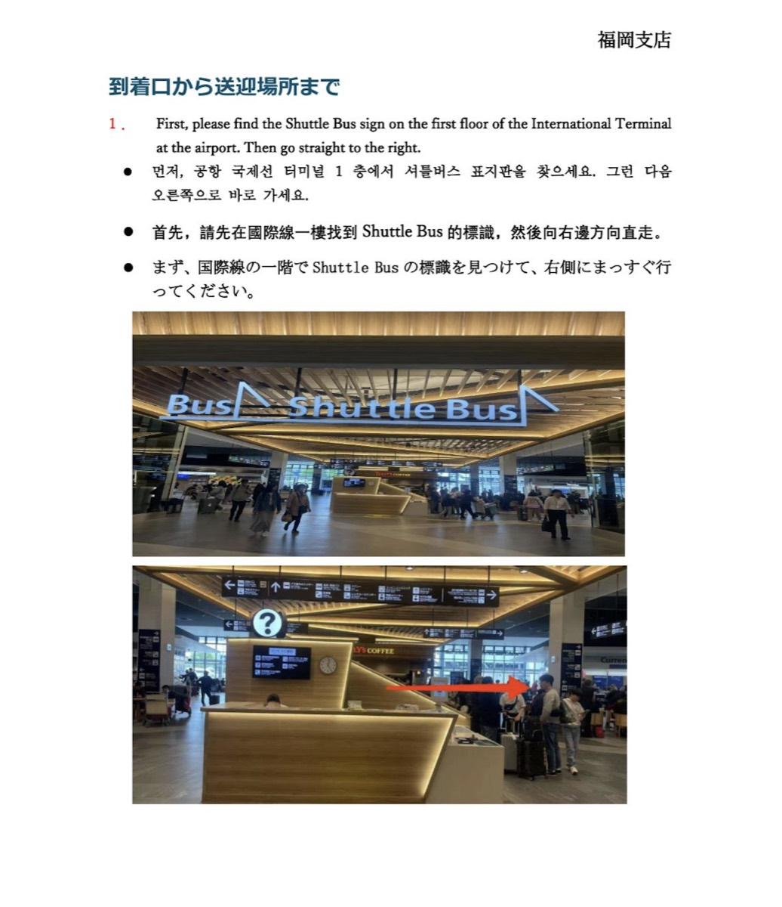
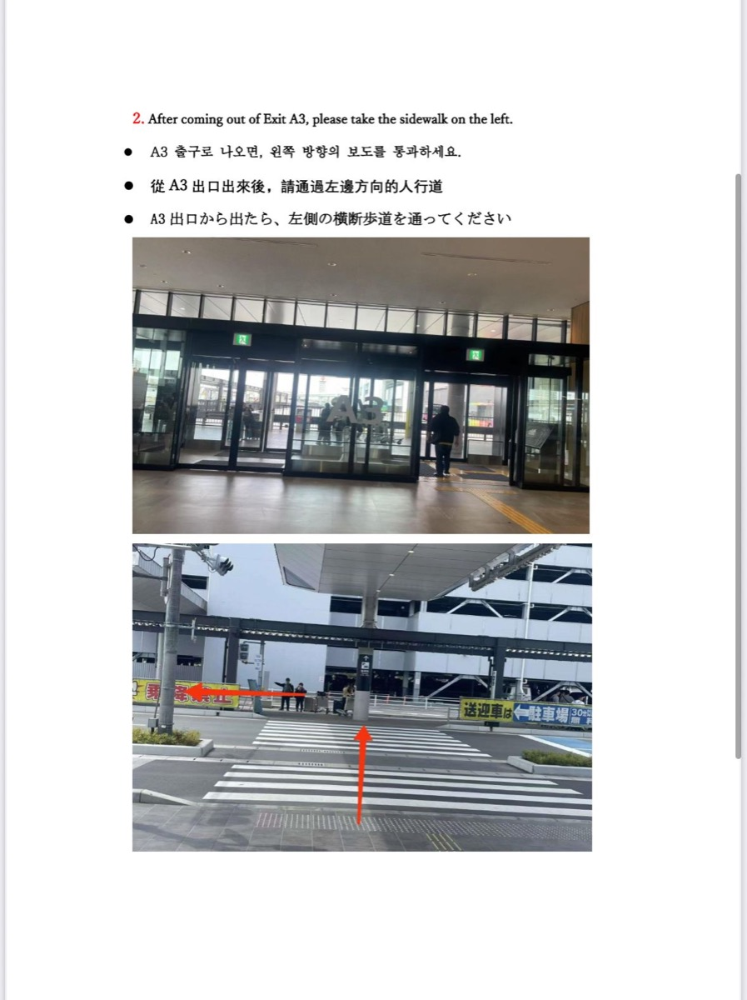
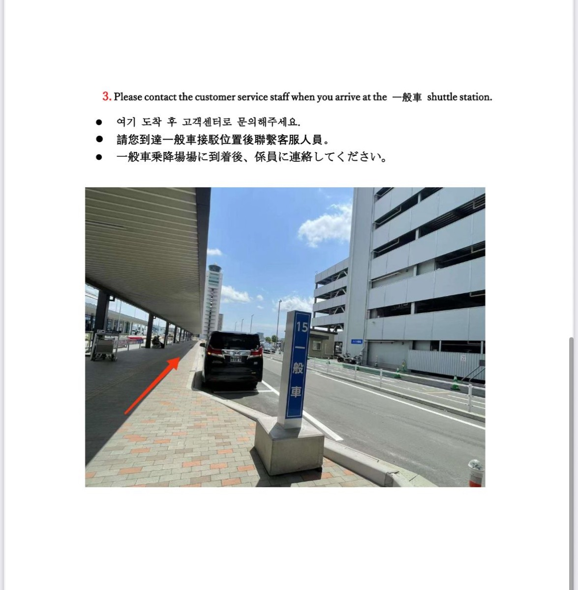
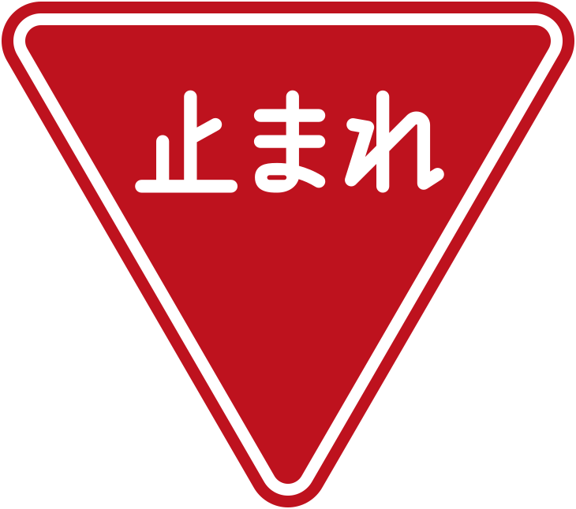
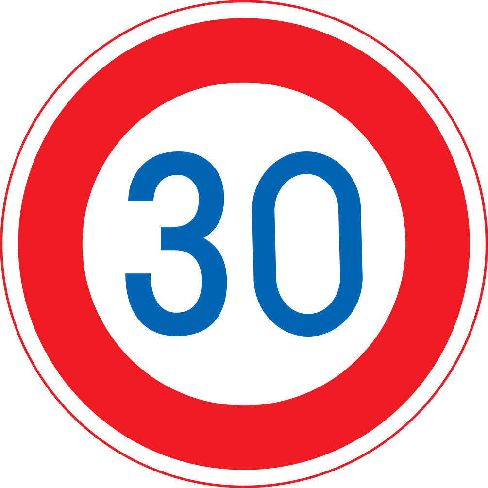
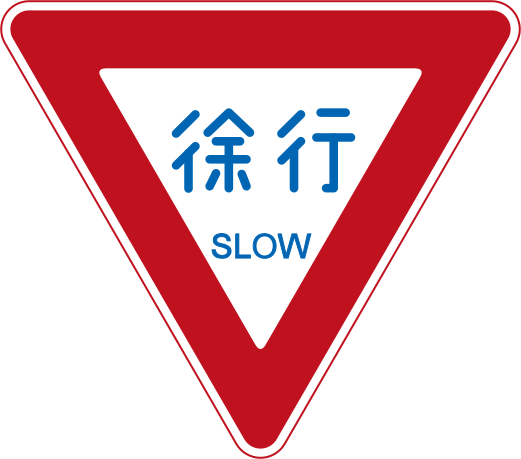
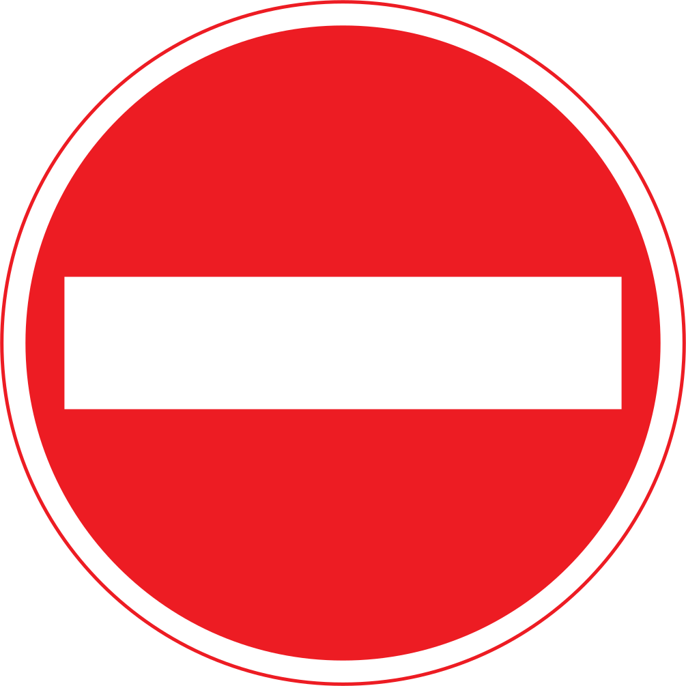
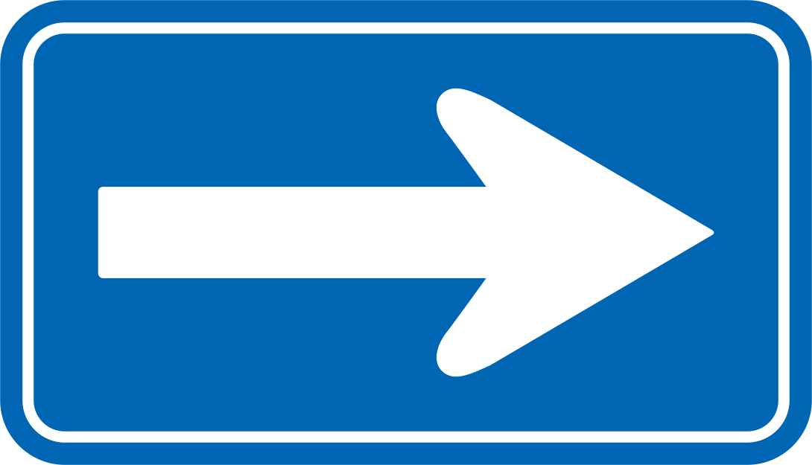
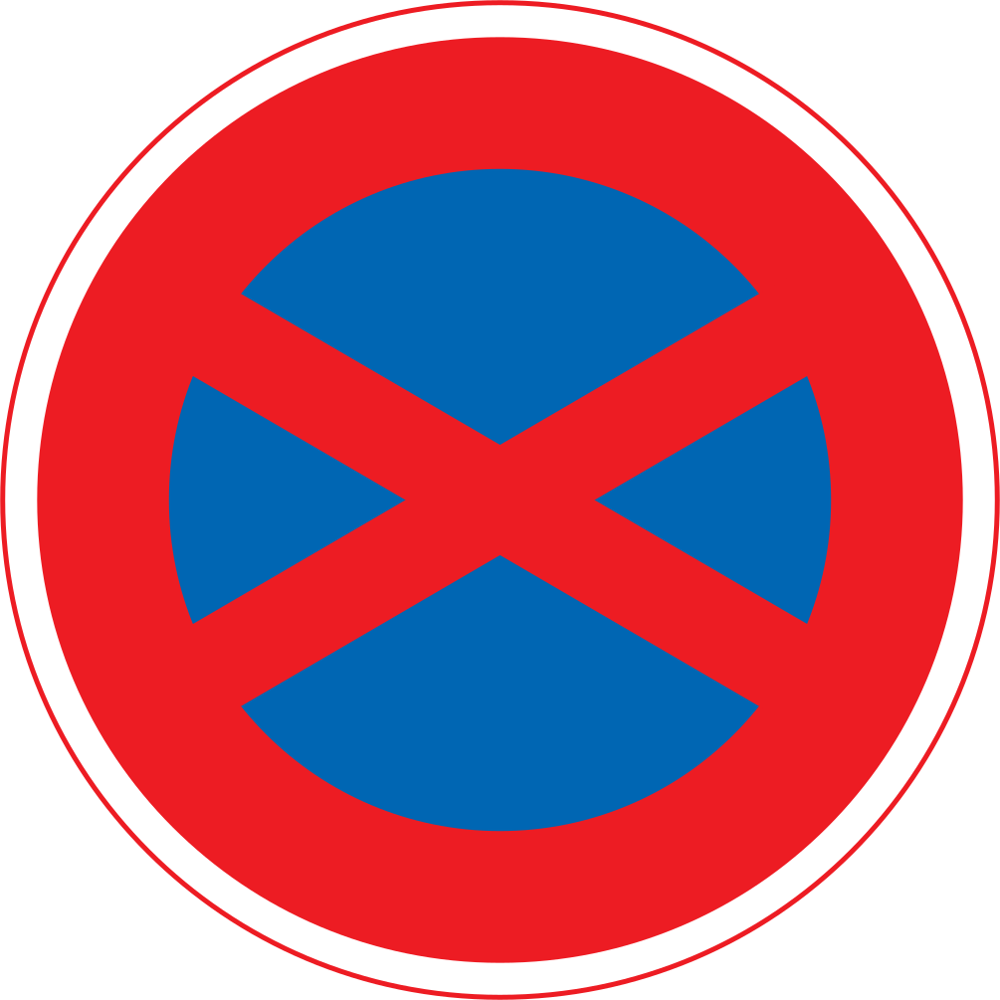
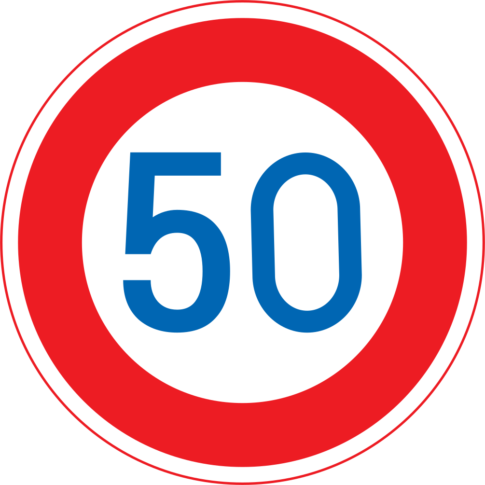

# 福岡九州 7 日自駕行程

> **2026/09/19（六）– 09/25（五）｜2 人｜自駕**
> 福岡 2 晚 → 熊本 2 晚 → 別府 2 晚

---

## 🚨 出發前必辦：IX RENTAL 改取／還車時間

> 📞 **供應商（福岡機場店）+81-80-3226-1688**｜Klook 訂單編號見 **Klook App**

**訂單上的取／還車時間跟班機完全對不上，必須聯絡供應商改時間，否則會出現「沒車可開」或「沒地方還車」的災難。**

| 項目 | 訂單寫的 | 實際需要 | 為什麼 |
|---|---|---|---|
| 🟥 **9/19 取車** | **10:00 AM** | **18:45–19:30**（傍晚）| 班機 CI0128 14:40 才從 TPE 起飛，18:05 才抵福岡 |
| 🟥 **9/25 還車** | **10:00 AM** | **14:30–15:00**（下午）| 班機 CI0117 21:00 才起飛，10:00 還車後乾等 11 小時太久 |

> ⚠️ **訂單條款寫「不可更改」**：時間異動只能透過供應商或 Klook 客服協調，**不保證改得動**。
> **2026/9/18 10:00 前可免費取消** — 若協調不成，這是重訂其他家的最後期限，務必在 9/18 前處理完。

### 💬 聯絡時要談的內容（我們走 LINE）
1. 報 Klook 訂單編號（**見 Klook App**；供應商 IX RENTAL、車型 Toyota Aqua 或同級）
   > 日文可用：「予約時間の変更をお願いしたいです」（想更改預約時間）
2. 「班機 CI0128 18:05 才落地，9/19 取車要改為 **18:45–19:30**」
3. 「9/25 還車要改為 **14:30–15:00**」
4. 順便確認：
   - **門市營業時間**（網路查到週日 08:00–20:00，其他日未確認，務必問清楚 9/19 週六與 9/25 週五的關門時間）
   - **接駁流程已知**（1F Shuttle Bus 標識 → A3 出口 → 一般車乘降場 → 打電話），要確認的是**末班時間**與**還車後回機場**怎麼安排
   - **兩位駕駛登記**（訂單已含免費 1 位多人駕駛，兩位都要日文譯本）
   - ETC 卡、GPS 已含在訂單內，取車時如何領取

### ⛑️ Plan B（供應商無法配合延後）
- **取車**：(A) 9/20 早上再取車（Day 1 改搭地鐵進博多）/ (B) 9/18 前免費取消，改訂 24 小時或營業到晚間的門市
- **還車**：(A) 維持上午還車 → 行李寄機場置物櫃 → 地鐵空港線到天神（藍瓶）→ 16:00 回機場

> ⏰ **立刻打**，不要拖過 **2026/9/18 10:00**（免費取消期限）。

---

## 📌 已確認訂單一覽

| 項目 | 編號 | 內容 |
|---|---|---|
| ✈️ 機票 | 訂位代號見 App | CI 0128 / CI 0117 來回 |
| 🚗 租車 | 訂單編號見 Klook App | IX RENTAL — Toyota Aqua 或同級（小型轎車）|
| 🏨 福岡 9/19、9/20 | 確認碼見 Booking App | 中今旅館（混合宿舍上下鋪 × 2 床位，TWD 4,956）|
| 🏨 熊本 9/21、9/22 | 確認碼見 Booking App | 熊本之門酒店（Semi-Private Bunk Bed 2 人房，TWD 4,397）|
| 🏨 別府 9/23、9/24 | 確認碼見 Booking App | Super Hotel 別府駅前（附沙發床雙人房・含早餐，TWD 3,976）|

> 🔒 訂位代號、確認碼、PIN 碼**不寫進這份公開文件**，出發前從 App 截圖或印紙本帶著。

---

## 🗺️ 七日路線概覽

| Day | 路線 |
|---|---|
| Day 1 | 福岡空港 → IX RENTAL 福岡機場店（取車）→ 中今旅館 |
| Day 2 | 中今旅館 →（步行早餐 山水水出珈琲）→ 糸島環線（一蘭の森・工房とったん・箱島神社・夫婦岩 二見ヶ浦）→ 中今旅館 |
| Day 3 | 中今旅館 → 食堂おわん → 太宰府（星巴克・一蘭）→ 柳川松濤園・藩主立花邸 → 熊本之門酒店 → Bic Camera（熊本駅）|
| Day 4 | 熊本之門酒店 → 熊本城 → 城彩苑 → 阿蘇周邊（米塚・草千里・大觀峰）→ 熊本之門酒店 |
| Day 5 | 熊本之門酒店 → やまなみハイウェイ → 九重夢大吊橋 → 由布院（湯の坪街道・由布院駅）→ Super Hotel 別府駅前 |
| Day 6 | Super Hotel 別府駅前 → 海地獄 → 鐵輪（地獄蒸し）→ 明礬 → グローバルタワー → 竹瓦温泉 → Super Hotel 別府駅前 |
| Day 7 | Super Hotel 別府駅前 → 天神（藍瓶）→ IX RENTAL 福岡機場店還車 → 福岡空港（免稅店買伴手禮）|

> 🚗 租車店家「**IX RENTAL 福岡機場店**」位於博多区西月隈 2-4-31，福岡空港西南約 2 km。接駁：到國際線「一般車」乘降場打電話請門市來接（流程見 [租車](#-租車)）；**營業時間與還車後回機場方式尚未確認，務必致電 +81-80-3226-1688 問清楚**。

---

## ⚠️ 最重要警告：2026 年九州「白銀週 5 連休」

**2026/9/19–9/23 是日本 11 年來首次出現的「Silver Week 5 連休」**：
- 9/19（六）9/20（日）週末
- 9/21（一）**敬老日**
- 9/22（二）**國民休日**（被祝日夾住自動成假日，11 年來首見）
- 9/23（三）**秋分日**
- 加上 9/24-25 請假可能變成 9 連休

**對行程的影響：**
- 🚗 高速公路會極度塞車，從福岡到熊本/阿蘇/由布院的車程要**抓平常 1.5 倍**
- 🍴 太宰府、柳川、由布院等熱門景點人爆滿
- ⛽ 高速 SA/PA、加油站可能排隊

---

## 📑 目錄

- [🚨 出發前必辦：IX RENTAL 改取／還車時間](#-出發前必辦ix-rental-改取還車時間)
- [✈️ 機票](#️-機票)
- [🏨 住宿](#-住宿)
- [🚗 租車](#-租車)
- [🅿️ 停車場一覽](#-停車場一覽)
- [🚦 日本自駕規則](#-日本自駕規則第一次開日本車必看)
- [🚇 市區交通（地鐵・市電・巴士）](#-市區交通地鐵市電巴士)
- [🎟️ 門票 & 用餐策略](#️-門票--用餐策略)
- [🍜 三間住宿周邊必吃](#-三間住宿周邊必吃)
- [🛍️ 必買紀念品 & 伴手禮](#️-必買紀念品--伴手禮)
- [📅 每日行程（含完整地址）](#-每日行程含完整地址)
- [🗺️ 每日路線連結](#️-每日路線連結)
- [💰 預算試算](#-預算試算)
- [✅ 出發前必辦清單](#-出發前必辦清單)
- [📱 必裝 App](#-必裝-app)
- [📞 緊急聯絡](#-緊急聯絡)

---

## ✈️ 機票

**訂位代號：見電子機票 / App**

| 日期 | 航班 | 起飛 | 抵達 |
|---|---|---|---|
| 9/19（六）| CI 0128 | 14:40 TPE | 18:05 FUK |
| 9/25（五）| CI 0117 | 21:00 FUK | 22:25 TPE |

---

## 🏨 住宿

| 入住日 | 飯店 | 地址 | 房型 / 房價 |
|---|---|---|---|
| 9/19、9/20 | **中今旅館** 🇯🇵 ゲストハウス中今 🇬🇧 GuestHouse Nakaima | 🇯🇵 福岡市博多区冷泉町 6-26（812-0039） 🇬🇧 6-26 Reisenmachi, Hakata-ku, Fukuoka 📞 +81-92-261-5070｜📍 N33 35.642 E130 24.681 | 混合宿舍上下鋪 × 2 床位 / **TWD 4,956**（¥24,800，現場付）|
| 9/21、9/22 | **熊本之門酒店** 🇯🇵 ホテル ザ ゲート熊本 🇬🇧 Hotel The Gate Kumamoto | 🇯🇵 熊本市西区春日 1-14-1（860-0047） 🇬🇧 1-14-1 Kasuga, Nishi-ku, Kumamoto 📞 +81-96-288-0170｜📍 N32 47.419 E130 41.461 | Semi-Private Bunk Bed 2 人房 × 2 晚 / **TWD 4,397**（¥22,000）|
| 9/23、9/24 | **Super Hotel 別府駅前** 🇯🇵 スーパーホテル別府駅前 🇬🇧 Super Hotel Beppu Ekimae | 🇯🇵 大分県別府市駅前町 13-8（874-0935） 🇬🇧 13-8 Ekimaecho, Beppu, Oita 📞 +81-977-73-9000｜📍 N33 16.738 E131 30.058 | 附沙發床雙人房・禁菸・**含早餐** × 2 晚 / **TWD 3,976**（¥19,894）|

> 住宿總價 **TWD 13,329**（每人 ~ TWD 6,665）

> 🗣️ **問路用**：日本人多半看不懂英文地址，**直接把 🇯🇵 那行給對方看**最快；🇬🇧 那行拿來在 Google Maps 搜尋、跟訂房紀錄對照。

### 各家關鍵注意事項

| 飯店 | 入住 / 退房 | 停車 | 一定要知道 |
|---|---|---|---|
| **中今旅館** | 9/19 **15:00–21:00** 入住 9/21 **11:00 前**退房 | ¥500/日，**無法預約**（現場問）| ⚠️ **21:00 後無法 check-in**，已告知抵達時間 20:00–21:00 櫃台 **11:00–15:00 無人**；當日可寄放行李 00:00–07:00 廚房 / 客廳 / 淋浴間停用 全館禁菸（門外有吸菸區）；僅樓梯可上樓 房價含 10% 消費稅；城市稅 ¥200/人/晚現場付 |
| **熊本之門酒店** | 9/21 **15:00–00:00** 入住 9/23 **07:00–10:00** 退房 | ⚠️ **飯店無停車設施**，須停附近付費停車場；地下車位**夜間關閉、無法取車** | 已在特殊要求註明需停車位，抵達前務必致電確認 **房內禁止用餐**（要用公共休息區） 男女**共用**淋浴間 / 廁所 / 洗手台 9/21 14:00 後取消不退款 |
| **Super Hotel 別府駅前** | 9/23 **15:00–00:00** 入住 9/25 **10:00 前**退房 | 附近私人停車場 ¥500/晚，**先到先停、不能預約** | **含早餐**（三家中唯一） Booking.com 已代付 ¥1,809 住宿方不提供網路 有刺青者公共澡堂可能受限 |

> 💡 中今旅館與熊本之門都是**共用衛浴的青年旅館型住宿**，不是獨立套房；Super Hotel 是一般商務旅館獨立衛浴。

---

## 🚗 租車

**Klook 訂單**（2026/07/11 下單；訂單編號見 Klook App）

| 項目 | 內容 |
|---|---|
| 車型 | **Toyota Aqua 或同級（小型轎車）** — 5 人座 / **2 件行李** / 自排 / 空調 |
| 租車公司 | **IX RENTAL**（Klook 平台訂購）|
| 取/還車門市 | **IX RENTAL 福岡機場店** 🇯🇵 アイエックスレンタカー 福岡支店 🇯🇵 福岡市博多区西月隈 2-4-31（812-0058） 🇬🇧 2-4-31 Nishitsukiguma, Hakata-ku, Fukuoka 📞 +81-80-3226-1688｜📍 福岡空港西南約 2 km |
| 取車 | 訂單 **2026/9/19（六）10:00** → **需改 18:45–19:30** |
| 還車 | 訂單 **2026/9/25（五）10:00** → **需改 14:30–15:00** |
| 門市營業時間 | ⚠️ **未確認**（網路查到週日 08:00–20:00，其他日需致電問）|
| 接駁 | **無定時接駁車**：到指定的「一般車」乘降場後**打電話**請門市來接（流程見下）|
| 費用 | **NT$ 6,697**（線上已付）|
| 燃油 / 里程 | 滿油取還車 / 無限里程 |
| 駕駛 | 兩位（訂單含免費 1 位多人駕駛；**兩位都需日文譯本**）|
| 已登記 | 駕駛 MR YANG（年齡 30–65）、航班 CI0128 |

### 🚌 機場 ↔ 門市 接駁流程（門市官方指引）

| Step | 做什麼 | 給日本人看的日文原句 |
|---|---|---|
| 1 | 國際線航廈 **1F** 找到 **「Shuttle Bus」標識**，往**右邊**直走 | 国際線の一階で Shuttle Bus の標識を見つけて、右側にまっすぐ行ってください |
| 2 | 從 **A3 出口**出去，走**左邊**的人行道（過斑馬線）| A3 出口から出たら、左側の横断歩道を通ってください |
| 3 | 抵達 **「一般車」乘降場**（藍色柱 **15** 號）後，**打電話給門市客服**請他們來接 | 一般車乗降場に到着後、係員に連絡してください |

| Step 1 | Step 2 | Step 3 |
|---|---|---|
|  |  |  |
| 1F「Shuttle Bus」標識 → 往右 | A3 出口 → 左邊人行道 | 15 號柱「一般車」→ 打電話 |

> 🖼️ 上圖為 **IX RENTAL 福岡支店官方指引**（日／英／中／韓四語），原檔放在 [`images/`](images/)。

> 📞 接人專線同門市電話 **+81-80-3226-1688**；「一般車」= 一般車輛乘降區，不是巴士站。
> ⚠️ 還車後回機場的接送方式**未確認**，取車時當面問清楚（9/25 班機 21:00 起飛，時間充裕但要先知道怎麼回機場）。

### 訂單已包含（不必另外加購）

| 項目 | 狀態 |
|---|---|
| ✅ **ETC 卡** | 已含（高速費按實際里程另付）|
| ✅ **GPS 導航** | 已含 |
| ✅ **多人駕駛** | 已含 1 位免費 |
| ✅ **租車自負額** | **US$ 0** |
| ✅ **車輛竊盜及搶奪保障** | **US$ 0** |
| ✅ **第三人責任險** | 自負額 US$ 1,237 |
| ✅ **營業損失賠償（NOC）** | 理賠上限 US$ 800 |

> ⚠️ **取／還車時間衝突**：班機 18:05 才抵 FUK，**9/19 上午 10:00 無法取車**；9/25 班機 21:00 起飛，10:00 還車後要空等 11 小時。
> 訂單標示「**不可更改**」，**2026/9/18 10:00 前可免費取消** — 協調不成就得在期限前重訂，處理細節見文件開頭「🚨 出發前必辦」。

> ⚠️ **行李限制只有 2 件**：Aqua 是小型轎車，7 天份行李 + 伴手禮要留意，採買集中在 Day 7 較安全。

> ❓ **Kyushu Expressway Pass (KEP)**：6 天 ¥15,000（官網 2026 版）。本次為 2 人小型車、高速里程約 600 km，**取車臨櫃請對方試算再決定**，多半用 ETC 實付較划算。

### 必備文件
- [ ] 台灣駕照正本（兩位駕駛）
- [ ] **駕照日文譯本**（兩位駕駛各一份；台灣監理所 NT$100，當天領）
- [ ] 護照
- [ ] Klook 租車憑證（建議印紙本）

---

## 🅿️ 停車場一覽

> 📅 2026/08 查證。日本幾乎沒有合法路邊停車，**每個點都要先想好停哪裡**。

| Day | 地點 | 停車場 | 費率 | 要注意 |
|---|---|---|---|---|
| 1・2・3早 | **中今旅館** | 旅館自有 | **¥500/日** | ⚠️ **無法預約**，抵達當天現場問櫃台 |
| | ↳ 備案 | **トラストパーク櫛田神社前**（冷泉町 8-4，步行 3 分）| **2 hr ¥500 / 12 hr ¥1,400** | 就在旅館旁 |
| | ↳ 備案 | Times（櫛田神社周邊）| 60 分 ¥200 日間上限 ¥1,500 **夜間 20:00–08:00 上限 ¥600** | 過夜停這種較划算 |
| 2 | **糸島全線**（一蘭の森・工房とったん・箱島神社・二見ヶ浦）| 各自附設 | **免費** | 二見ヶ浦傍晚會滿，**17:30 前卡位** |
| 3 | **太宰府** | 太宰府駐車センター | **¥500 一次**（入退場一律）| 850 台、8:00–17:00。**連假 10:00 後易滿**，我們排 9:00 到剛好 |
| 3 | **柳川 松濤園・立花邸** | 園區專用 | **免費** | 台數未公布 |
| 3・4 | **熊本之門酒店** | ⚠️ **飯店無停車場** | 附近 Times 約 30 分 ¥200 **24 hr 上限 ¥1,100–1,200** | Times JR熊本駅ビル第3（步行 2 分）／九州労働金庫熊本駅支店（2 分）／熊本駅前第4（3 分） ⚠️ **地下車位夜間關閉、無法取車** |
| 4 | **熊本城・城彩苑** | 城彩苑駐車場 | **2026/4/1 改制：2 hr ¥400，之後每 hr ¥200** | 我們停約 3.5 hr ≈ **¥800** |
| | ↳ 備案 | 二之丸・三之丸駐車場 | — | 4–10 月 8:00–18:30；城彩苑滿了停這，**有免費接駁巴士**（10–15 分一班）|
| 4 | **大觀峰** | 展望台停車場 | **免費** | 茶店 8:30–17:00 |
| 4 | **道の駅 阿蘇** | 道の駅 | **免費** | |
| 4 | **草千里** | 草千里駐車場 | **¥500/日** | 2024/7 起改**自動攝影記錄 + 後付制**（無人閘門，別以為沒收費就開走）|
| 5・6 | **Super Hotel 別府駅前** | 附近私人停車場 | **¥500/晚** | **先到先停、不能預約** |
| 5 | **九重"夢"大吊橋** | 吊橋停車場（中村區約 229 台）| **免費** | 8:30–18:00 |
| 5 | **由布院（湯の坪街道）** | 周邊民營停車場 | 依現場 | 官方：連假「周辺道路や駐車場が大変混雑」，先看停車場地圖 |
| 6 | **海地獄** | 附設 | **免費** | 8:00–17:00 |
| 6 | **明礬温泉 湯の里** | 附設 80 台 | **免費** | |
| 6 | **グローバルタワー** | 室外 138 台／室內 58 台 | 室外**免費**；室內首 1 hr 免費、之後 ¥100/hr | |
| 6 | **竹瓦温泉** | ⚠️ **無停車場** | 周邊投幣式 | |
| 3 | **Bic Camera 熊本（アミュプラザ）** | 車停飯店附近的 Times，走路過去 | — | 飯店步行 2–5 分 |
| 7 | **天神（藍瓶）** | 周邊投幣式停車場 | 依現場 | 藍瓶沒有停車場；若順便逛 Bic，提携「天神ビックタワー駐車場」單張收據滿 ¥3,000 送 1 hr |

> 💡 **投幣停車場怎麼用**：車輪下擋板升起 → 離開前到繳費機**輸入車位號碼**付款 → 擋板降下才能開走。忘記付款開不走。

> 💰 **停車費預估（6 天）**：中今 ¥1,000 + 熊本 2 晚約 ¥2,400 + 景點 ¥2,500 + 別府 ¥1,000 ≈ **¥7,000**（已列入預算表）。

---

## 🚦 日本自駕規則（第一次開日本車必看）

> 📅 2026/08 查證。**我們 9/19 出發，正好在 2026/9/1 新制上路之後**，速限規則跟以前的攻略文不一樣。

### 🚨 2026/9/1 新制：生活道路法定速度 60 → **30 km/h**

**沒有中央線（分隔線）的一般道路，未特別標示時，法定速度就是 30 km/h。**

| 項目 | 內容 |
|---|---|
| 施行日 | **2026/9/1**（我們出發前 18 天）|
| 對象 | **沒有中央線／中央分隔島**的道路，多為**寬度未滿 5.5 m** 的窄路 |
| 範圍 | 全國國道・都道府県道・市町村道的**約 7 成** |
| 舊制 | 無標誌時原則 60 km/h |

> ⚠️ **對我們的實際影響**：博多冷泉町老街巷弄、糸島鄉間小路、柳川市區、別府北浜巷弄 —— 這些路以前沒標誌可跑 60，**現在預設 30**。看到路面沒有中央線就自動降到 30，最安全。

### 📄 三份文件缺一不可

| 文件 | 說明 |
|---|---|
| ✅ **台灣駕照正本** | 影本無效 |
| ✅ **駕照日文譯本** | 台灣監理所申請 NT$100，當天領。**不是國際駕照**（日本不承認台灣的國際駕照）|
| ✅ **護照** | 三者缺一，租車公司直接拒絕交車 |

> 兩位駕駛**各自**都要備齊三份。

### 🚸 一定要看懂的號誌

| 號誌 | 日文 | 意思 |
|---|---|---|
|  | **止まれ** | **完全停止 3 秒**（紅色倒三角）|
|  | **最高速度** | 圈內數字 = 速限上限；無標誌的窄路預設 30 |
|  | **徐行 / SLOW** | 減速到隨時能停（約 10 km/h）|
|  | **車両進入禁止** | 禁止進入（多為單行道逆向）|
|  | **一方通行** | 單行道，只能往箭頭方向 |
|  | **駐車禁止** | 禁止停車，可短暫上下客 |
|  | **駐停車禁止** | 連停下來都不行（斜線交叉 = 更嚴）|
|  | **最高速度 50** | 標誌永遠優先於法定速度 |

> 💡 **藍底 = 指示（可以做）、紅圈 = 禁止、紅色倒三角 = 停下來** —— 記這三個顏色規則就能猜對八成。

> 📜 號誌圖為日本《道路標識、區劃線及道路標示相關命令》的法定圖形，屬公共領域（著作權法第 13 條）；SVG 取自 Wikimedia Commons（Public domain）。

### 🇯🇵 台灣人最容易犯的 5 件事

| # | 事項 | 說明 |
|---|---|---|
| 1 | **靠左行駛・右駕** | 方向盤在右、車走左側。**最容易出錯的是右轉**（切到對向）與**出停車場**時 |
| 2 | **雨刷 ↔ 方向燈相反** | 日本車雨刷在左、方向燈在右，跟台灣相反。前三天一定會打錯，習慣就好 |
| 3 | **「止まれ」必須完全停止** | 紅色**倒三角**標誌 + 路面「止まれ」，**輪子要停死 3 秒**再走，滑行過去就是違規。日本無號誌路口極多、取締也多 |
| 4 | **行人絕對優先** | 斑馬線前有人（含在等的人）**一定要停**，近年取締非常嚴。日本駕駛都會停，跟著停就對了 |
| 5 | **鐵路平交道一律停車** | 不管有沒有柵欄、有沒有車，**都要停下確認左右**再過 |

### 🚗 速限

| 道路 | 法定速度 |
|---|---|
| **高速公路** | **100 km/h**（部分區間 120；一律依現場標誌）|
| 一般道路（有中央線）| 60 km/h |
| **生活道路（無中央線）** | **30 km/h**（2026/9/1 起）|
| 標誌有寫 | **以標誌為準**（標誌 > 法定）|

> 📷 日本測速照相（オービス）與埋伏取締都不少，九州道尤其常見。**超速 30 km/h 以上可能直接吊照 + 刑事罰**，不值得。

### ⛔ 絕對不能做

| 違規 | 後果 |
|---|---|
| 🍺 **酒駕** | 酒氣帶：**3 年以下拘禁刑或 50 萬日圓罰金**；酒醉：**5 年以下拘禁刑或 100 萬日圓罰金** |
| 🍺 **搭酒駕者的車** | **同乘者也會被罰**（道交法 65 條）；提供車輛、提供酒給駕駛者同樣有罪 |
| 📱 **開車用手機** | 2019 年起罰則大幅加重，拿在手上就違規；導航要看請靠邊停 |
| 🚸 **不繫安全帶** | **後座也必須繫**，包含高速與市區 |

> 💡 **日本是零容忍**：喝一口都算。晚餐要喝酒就把車留在飯店停車場，隔天再開。

### ⛽ 加油（**加錯油會毀引擎**）

| 日文 | 是什麼 | 我們的車 |
|---|---|---|
| **レギュラー**（Regular）| 一般無鉛汽油 | ✅ **Toyota Aqua 加這個** |
| ハイオク（High-oct）| 高級汽油 | ❌ 不需要 |
| **軽油** | ⚠️ **柴油！不是汽油** | ❌ **絕對不能加**，加了引擎報銷 |

> ⚠️ 「軽油」看起來像「輕的油」，是台灣人最常加錯的一項。**認 レギュラー（紅色油槍）就對了**。
> 🈵 租車合約是**滿油取還**，還車前找加油站加滿並保留收據。
> 🗣️ 自助加油站說「レギュラー、満タン（man-tan）」= 一般汽油加滿。

### 🅿️ 停車

- **路邊停車＝違規**（日本幾乎沒有合法路邊停車），一律停 **コインパーキング**（投幣停車場）
- 常見機制：車輪下的擋板升起 → 離開前到繳費機輸入車位號碼付款 → 擋板降下才能開走
- 觀光地停車場多為 ¥500/次，市區按時計費
- 熊本之門酒店**沒有自己的停車場**，要另找附近付費停車場

### 🛣️ 高速公路

- **ETC 卡已含在租車訂單內**，走 ETC 車道（紫色標示），**時速降到 20 km/h 以下**通過
- **左側是行車道、右側是超車道** —— 超完車要回左道，一直佔右道會被取締
- SA（服務區）/ PA（停車區）都有廁所、餐廳，**九州道約每 20–30 km 一個**
- 連假（9/19–9/23）塞車嚴重，車程抓平常 1.5 倍

### 🆘 出事怎麼辦

| 狀況 | 打給誰 |
|---|---|
| 事故（有人受傷）| **119**（救護）+ **110**（警察）|
| 事故（無人受傷）| **110** — 日本**一定要報警**才有事故證明，否則保險不理賠 |
| 車輛故障 / 沒電 / 爆胎 | **JAF #8139**（24h）|
| 任何情況都要打 | **IX RENTAL +81-80-3226-1688** |

> 📋 我們的保險：**租車自負額 US$0**、車輛竊盜 US$0、第三人責任險（自負額 US$1,237）、NOC 營業損失賠償上限 US$800 —— 已全包在訂單內。
> ⚠️ 但**肇事逃逸、酒駕、無照**等情況保險一律不理賠。

---

## 🚇 市區交通（地鐵・市電・巴士）

> 本行程 **9/19 傍晚取車 → 9/25 下午還車全程自駕**，以下是「不開車時」的備援：Day 7 還車後的採買、市區夜間移動、喝酒不開車、車子停飯店步行逛街。
> 📅 以下為 **2026/08 查證**的現況，票價可能調整，出發前再對一次官網。

### 🌸 福岡市地下鐵（福岡市地下鉄 / Fukuoka City Subway）

三條線，觀光幾乎只會用到空港線。

| 路線 | 日文 / English | 區間 | 對我們的用途 |
|---|---|---|---|
| **機場線** | 空港線（1號線）/ Kuko Line | 福岡空港 ↔ 博多 ↔ 天神 ↔ 姪浜 | **主力**：機場、博多站、天神、中洲川端 |
| **箱崎線** | 箱崎線（2號線）/ Hakozaki Line | 中洲川端 ↔ 貝塚 | 幾乎用不到 |
| **七隈線** | 七隈線（3號線）/ Nanakuma Line | 橋本 ↔ 天神南 ↔ **博多** | 2023 延伸到博多站；去藥院、大濠方向 |

| 項目 | 內容 |
|---|---|
| 🎫 **福岡空港 → 博多站** | **¥260 / 約 5 分**（空港線 2 站）|
| ⚠️ **國際線航廈沒有地鐵站** | 要先搭**免費連絡巴士**到國內線航廈（約 10 分）再轉地鐵，**全程約 20 分** |
| 🎟️ **一日乘車券** | **¥640**（全線一日不限次；兒童 ¥320）|
| 💳 IC 卡 | Suica / PASMO / ICOCA 等全國互通卡都能直接刷 |
| 🕐 班距 | 白天約 5–8 分一班 |

> 🚕 **Day 1 用不到地鐵**：我們是出國際線後直接走去 IX RENTAL 的一般車乘降場等接駁。
> 💡 **中今旅館最近的站是「中洲川端駅」（空港線・箱崎線）**，步行約 5 分；博多站搭地鐵 1 站即到。

### 🐻 熊本市電（熊本市電 / Kumamoto City Tram）

熊本**沒有地鐵**，市區靠路面電車（市電）+ JR。

| 系統 | 日文 / English | 區間 |
|---|---|---|
| **A 系統** | Ａ系統 / Line A | **田崎橋 ↔ 熊本駅前 ↔ 辛島町 ↔ 熊本城・市役所前 ↔ 健軍町** |
| **B 系統** | Ｂ系統 / Line B | 上熊本 ↔ 辛島町 ↔ 健軍町 |

| 項目 | 內容 |
|---|---|
| 🎫 車資 | **大人均一 ¥200**、兒童 ¥100（2025/6 起調整，2026 仍適用）|
| 🎟️ 一日乘車券 | 紙本 **¥700**；**手機版較便宜**（熊本市交通局 App / 九州 MaaS）|
| 🏯 **熊本駅前 → 熊本城・市役所前** | 搭 **A 系統**，約 10 分、¥200 |
| ⚠️ 轉乘 | 上熊本方向（B 系統）↔ 田崎橋方向（A 系統）要在 **辛島町** 換車 |

> 💡 **熊本之門酒店就在熊本駅東口（白川口）步行 1 分**（熊本森都心プラザ 1F），走到「熊本駅前」電停即可上車 — Day 4 熊本城不想找停車位的話，市電是省事的選項（城彩苑旁就是電停）。

### ♨️ 別府（Beppu）

別府**沒有地鐵也沒有市電**，靠 **龜之井巴士（亀の井バス / Kamenoi Bus）** + JR 日豐本線。

| 項目 | 內容 |
|---|---|
| 🚌 主要業者 | 龜之井巴士 — 別府駅 / 別府駅西口 / 鐵輪 為主要轉運點 |
| 🎟️ 一日券 | **My Beppu Free（マイべっぷフリー）迷你版**：別府市內（含鐵輪・地獄巡迴區）一日不限次 — **價格出發前於官網或九州 MaaS 確認** |
| 🚉 JR | 日豐本線 別府 ↔ 大分 約 12 分 |
| 🅿️ 我們的情況 | Super Hotel 就在**別府駅前**，鐵輪走 Day 6 自駕即可，巴士只是備援 |

---

## 🎟️ 門票 & 用餐策略

### 🍽️ 用餐策略：**我們不預約，全部現場**

不訂位就得靠時間差。下面是每家的開門時間與該去的時段：

| 餐廳 | 營業時間 | 現場攻略 |
|---|---|---|
| **藩主立花邸 蒸籠鰻魚飯**（Day 3）| **11:00–15:00** | ⚠️ **最需要留意的一家**。L.O. 未公布，Day 3 已把行程調成 **13:00 進場**；再晚就有吃不到的風險 |
| **一蘭 太宰府参道店**（Day 3 午餐）| 9:00–19:00（L.O. 18:45）全年無休 | **10:00 去**。只有 16 席，連假中午要等 30 分以上 |
| **一蘭の森**（Day 2 午餐）| 依官網 | 現場候位，連假抓排隊 30 分 |
| **食堂 おわん**（Day 3 早餐）| 7:30–10:00（L.O. 9:30）| ⚠️ **不定休**，有撲空的可能。備案：川端商店街早餐店或便利商店 |
| **水炊き 若杉 本店** / **橙** | 晚間 | 不訂位就**開店就進場**（17:30–18:00），晚到要等 |
| **博多もつ鍋 おおやま / 笑樂** | 晚間 | 連假尖峰 19:00 後大排長龍，**18:00 前入座** |
| **とよ常 本店**（別府天婦羅）| 午/晚 | 銅板神店，人多；避開 12:00 與 19:00 |

> 🎯 **不預約的通則：比人潮早一輪**。午餐 11:00 前、晚餐 18:00 前入座，連假幾乎都不用排。

> ⚠️ **唯一真正有風險的是 Day 3 的鰻魚飯**（15:00 就關）。若當天塞車趕不上，備案是柳川市區的 **若松屋** 或 **本吉屋**（晚間也營業）。

### 需要門票（成人單張）

| 景點 | 門票 | 備註 |
|---|---|---|
| **熊本城**（天守閣 + 城內）| ¥800 | 高中以上；現場買；9:00–17:00（最終入園 16:00）；**8/13 震後重新開園** |
| **海地獄**（Day 6，單館）| ¥450 | 8:00–17:00；我們只看這一個（7 個共通券 ¥2,400）|
| **九重"夢"大吊橋**（Day 5）| ¥500 | 國中生以上；8:30–18:00（售票至 17:30）|
| **グローバルタワー**（Day 6）| ¥300 | 展望台 9:00–21:00（3–11 月）|
| **COMICO ART MUSEUM**（Day 5，選擇性）| ¥1,700 | 事前預約優先，線上折 ¥200 |
| **柳川松濤園・藩主立花邸**（松濤園 + 大廣間 + 西洋館 + 立花家史料館）| ¥1,000 | 現場買；見學 10:00–16:00 |
| **阿蘇火山博物館**（選擇性）| ¥1,100 | 草千里旁，**警戒等級 2（9/4 起）照常開放**；停車免費 |
| **竹瓦溫泉**（選擇性）| 入浴 ¥300 / 砂湯 ¥1,500 | 明治創業的公共浴場；外觀參觀免費 |
| **地獄蒸し工房**（按食材）| ¥500–1,500/份 | 食材費 + 蒸し釜 小 ¥400／大 ¥600（15 分內）；不接受預約，現場排隊 |

### 完全免費

- 箱島神社、夫婦岩 二見ヶ浦、太宰府天滿宮（參道）、城彩苑、米塚展望所、草千里浜（停車 ¥500）、大觀峰、道の駅 阿蘇、長者原、由布院湯之坪街道、由布院駅・YUFUiNFO、明礬湯之里

---

## 🍜 三間住宿周邊必吃

### 🏨 福岡 中今旅館 周邊（博多区冷泉町）

> 中今旅館位於博多老街冷泉町，**步行 3 分到櫛田神社、川端商店街**，5–10 分到中洲、博多運河城

| 必吃 | 地址 / 提醒 |
|---|---|
| **一蘭 本社總本店**（24h）| 博多区中洲 5-3-2；本社限定「重箱」吃法（Day 2、3 都吃一蘭了，可跳過）|
| **博多もつ鍋 おおやま 本店** | 博多区中洲 3-7-24；醬油味噌湯頭都神 |
| **博多もつ鍋 笑樂 本店** | 中央区西中洲 11-4 |
| **水炊き 橙**（中洲）| 博多区中洲 5-3-8；雞湯系名店 |
| **水炊き 若杉 本店** | 博多区奈良屋町 8-12（旅館步行 7 分）|
| **元祖博多めんたい重** | 中央区西中洲 6-15；明太子米飯重 |
| **博多運河城 Ramen Stadium** | 5F 拉麵主題集合 |
| **食堂 おわん** | 博多区冷泉町 9-20 1F（旅館步行 2 分）；土鍋炊飯早餐 7:30–10:00（L.O. 9:30）|
| **川端ぜんざい広場** | 川端商店街內，紅豆湯名店（旅館步行 3 分）|

### 🏨 熊本 熊本之門酒店 周邊（西区春日，熊本駅東口）

> 飯店就在**熊本駅東口（白川口）步行 1 分**（熊本森都心プラザ 1F），JR / 市電 / アミュプラザ 都在步行範圍

| 必吃 | 地址 / 提醒 |
|---|---|
| **菅乃屋 熊本駅店**（馬肉專門）| 熊本駅內（飯店步行 5 分）；馬刺身 / 馬肉壽司 / 烤馬肉膳 |
| **勝烈亭 新市街本店**（炸豬排）| 中央区新市街 8-18 |
| **桂花拉麵 本店** | 中央区花畑町 11-9；熊本豚骨元祖之一 |
| **天外天 本店**（拉麵）| 中央区安政町 |
| **黒亭 本店**（拉麵）| 西区二本木 2-1-23（飯店步行 8 分）；熊本拉麵名店 |
| **大關馬肉**（馬肉料理）| 中央区下通；熟食 / 馬肉醬煮 |
| **いきなり団子** | 路邊小吃 / 熊本駅內物產館；地瓜紅豆糕，名物 |

### 🏨 別府 Super Hotel 別府駅前 周邊（駅前町）

> 飯店就在**別府站前**，步行 1–2 分到車站、5 分到北浜海岸、10 分到別府塔

| 必吃 | 地址 / 提醒 |
|---|---|
| **とよ常 本店**（天婦羅）| 北浜 2-12-24；特上天丼 ¥980 銅板神店 |
| **冷麺の胡月**（別府冷麺名店）| 石垣東 8-1-26；週二休、**週三只到 17:30** |
| **お食事處 千成**（鄉土料理）| 北浜 1-9-2（步行 6 分）|
| **東洋軒 別府本店**（炸雞元祖）| 石垣東 7-8-22；大分炸雞發源 |
| **岡本屋売店**（明礬）| 明礬 3 組；8:30–18:30（L.O. 17:30）；地獄蒸布丁、溫泉蛋 |
| **べっぷ駅市場** | 別府站旁（步行 3 分）；當地早餐、関アジ握り |
| **甘味茶屋**（だんご汁）| 実相寺 1-4；大分鄉土麵食 |
| **友永パン屋**（百年麵包店）| 千代町 2-29；當地人早餐 |

---

## 🛍️ 必買紀念品 & 伴手禮

### 🥢 福岡 / 博多

| 品項 | 推薦 | 哪裡買 |
|---|---|---|
| **明太子**（最名物）| ふくや / やまや / 博多あごおとし | 博多阪急 B1、博多デイトス、機場 |
| **博多通りもん** | 西洋風白餡饅頭（必買）| 全部物產店都有 |
| **二○加煎餅** | 福岡老舖煎餅 | 博多デイトス、機場 |
| **博多ぽてと** | 紫芋蛋糕 | 博多デイトス |
| **鶴乃子**（石村萬盛堂）| 白蛋黃棉花糖 | 博多老舖 |
| **博多もつ鍋 真空包** | 帶回家煮 | おおやま、笑樂 公式店 |
| **明月堂 博多通りもんアイス**（夏季限定）| 通りもん冰淇淋 | 機場 |

### 🐴 熊本

| 品項 | 推薦 | 哪裡買 |
|---|---|---|
| **馬肉商品** | 馬肉味噌、馬肉ジャーキー、馬刺し醬油 | 城彩苑、熊本駅物產館 |
| **いきなり団子（真空版）** | 地瓜紅豆糕禮盒 | 城彩苑、熊本駅 |
| **誠味屋 陣太鼓** | 紅豆羊羹名菓 | 城彩苑、熊本駅 |
| **くまモン周邊** | 玩偶、文具、零食 | 城彩苑「くまモンスクエア」、機場 |
| **球磨燒酎** | 米焼酎，送禮佳品 | 熊本駅物產館 |
| **天草鹽** / **阿蘇牛乳製品** | 餅乾、起司 | 道の駅 阿蘇 |

### ♨️ 別府 / 大分

| 品項 | 推薦 | 哪裡買 |
|---|---|---|
| **湯花入浴劑**（湯之花）| **明礬湯之里限定**，硫磺溫泉粉 | 明礬湯之里現場、別府站 |
| **岡本屋 地獄蒸布丁** | 在地名物 | 明礬 岡本屋売店（不耐放，當天吃）|
| **かぼす（臭橙）製品** | 果汁、ぽん酢、果凍 | 別府站、道の駅 |
| **椎茸乾貨** | 大分名物 | 別府站、道の駅 |
| **関アジ・関サバ 加工品** | 一夜干、罐頭 | 別府站、福岡空港 |
| **由布院 B-speak ロールケーキ** | 鮮奶蛋糕卷（限購、當天吃）| 湯之坪商店街（Day 5 順買）|
| **Snoopy 茶屋限定品** | 由布院店限定 | 湯之坪商店街 |
| **湯けむり饅頭** | 別府限定饅頭 | 別府站 |

### 🛒 採買時機建議

| Day | 採買重點 |
|---|---|
| Day 2 | 工房とったん 買「またいちの塩」花藻塩；一蘭の森 限定拉麵伴手禮 |
| Day 4 | 城彩苑 + 道の駅 阿蘇 採買熊本伴手禮（馬肉、阿蘇牛乳製品）|
| Day 5 | 由布院湯之坪商店街（B-speak、Snoopy）；別府站買湯花、布丁 |
| Day 6 | 明礬湯之里再補湯花；岡本屋當天現買布丁 |
| Day 3 | **Bic Camera 熊本（アミュプラザ）**照下方必買清單買 |
| Day 7 | 明太子、通りもん在**機場出境後免稅店**買；熊本沒買到的在天神 Bic 或機場 Air BicCamera 補 |

### 🔌 Bic Camera 必買清單（Day 3 熊本）

> **主場：Day 3 傍晚 アミュプラザくまもと店**（熊本市西区春日 3-15-60 JR熊本白川ビル 1F・2F，10:00–20:00，飯店步行 2–5 分）。熊本只有這一間 — 沒買到的，Day 7 在天神 1・2 号館（藍瓶旁）或機場出境後的 **Air BicCamera** 補。吹風機、塵蟎機的箱子放後座（只有 2 人，後座空著）。其他天順路的店見各天的「🔌 附近 Bic Camera」。

| # | 品項 | 日本型番 | 參考價（含稅）| 電壓 / 台灣能不能用 | 備註 |
|---|---|---|---|---|---|
| 1 | **吹風機** | Panasonic **EH-NE7N**（[台灣商品頁](https://gmonline.twglobalmall.com/product/2EC0321160001015) 對應型號，⚠️ 待確認）| ⚠️ 未查到 | ⚠️ **日本版只有 AC100V**（官方規格：「電源・電圧：AC100V 50-60Hz」）| 台灣 110V 使用有風險，買前再想想或改挑國際電壓款 |
| 2 | **刮鬍刀** 掌上型 5 枚刃 | Panasonic **ラムダッシュ パームイン** ES-PV6A／ES-PV3A | ⚠️ 未查到（部分款已停產）| ✅ **AC100–240V 自動切換** | USB Type-C 充電 |
| 3 | **塵蟎機** | アイリスオーヤマ 布団クリーナー **FCA-B2H**／FCA-A3 | FCA-B2H 約 ¥17,720–18,800（⚠️ 未證實）| ⚠️ **只有 AC100V**（規格：「電源： AC100V（50/60Hz）」）| 同吹風機 |
| 4 | **滑鼠墊**（劍匠）| **ARTISAN（アーチサン）** NINJA FX ゼロ／飛燕 | XXL 約 ¥7,500（⚠️ 未證實）| 不需電 | 先決定尺寸與軟硬度 |
| 5 | **滑鼠**（palus）| 推測是 **Pulsar（パルサー）** X2V2／Xlite 系列（⚠️ 待確認）| X2V2 約 ¥9,700（⚠️ 未證實）| USB | |

- 🔎 **出發前查庫存**：biccamera.com 商品頁可以查各店在庫，先確認熊本アミュプラザ店有沒有貨
- 🛂 **免稅**：帶**護照正本**；熊本店在店內免稅對應收銀台辦理（⚠️ 未查到官方頁面）。⚠️ 門檻、入境章規定未查到官方頁面 — 保險起見入境時請審查官蓋入境章

---

## 📅 每日行程（含完整地址）

> 每個 spot 都附完整地址；對應 Google Maps 連結整理在文末的「每日路線連結」。

---

### Day 1｜9/19（六）抵達日｜🏨 中今旅館

**路線**：福岡空港 → IX RENTAL 福岡機場店（取車）→ 中今旅館

| 順序 | Spot | 地址 |
|---|---|---|
| 1 | **福岡空港 國際線航廈** 🇯🇵 福岡空港 国際線ターミナル 🇬🇧 Fukuoka Airport Int'l Terminal | 福岡市博多区下臼井 778-1（812-0003）|
| 2 | **IX RENTAL 福岡機場店** 🇯🇵 アイエックスレンタカー 福岡支店 🇬🇧 IX Rental Fukuoka Airport | 🇯🇵 福岡市博多区西月隈 2-4-31（812-0058） 🇬🇧 2-4-31 Nishitsukiguma, Hakata-ku, Fukuoka 📞 +81-80-3226-1688 |
| 3 | **中今旅館** 🇯🇵 ゲストハウス中今 🇬🇧 GuestHouse Nakaima | 🇯🇵 福岡市博多区冷泉町 6-26（812-0039） 🇬🇧 6-26 Reisenmachi, Hakata-ku, Fukuoka 📞 +81-92-261-5070 |

**預估車程**：機場 → IX RENTAL 約 2 km（門市接駁，到「一般車」乘降場打電話）→ 取車後開往旅館約 6 km / 20 分

| 時間 | 行動 |
|---|---|
| 18:05 | CI0128 抵 FUK 國際線 |
| 18:30 | 入境 → 提行李 |
| 18:35 | 出航廈 → **1F Shuttle Bus 標識往右** → **A3 出口**左側人行道 → **「一般車」乘降場（15 號柱）**打電話叫接駁 |
| 19:00 | **抵 IX RENTAL 取車**（門市關門時間待確認，取車時間需事前協調）|
| 19:30 | 取車完畢，開往中今旅館 |
| 19:50 | **Check-in 中今旅館**（⚠️ **入住只到 21:00**，已告知抵達時間 20:00–21:00）|
| 20:30 | 晚餐：**博多もつ鍋 おおやま 本店**（中洲）/ **水炊き 若杉 本店**（步行 7 分）|
| 22:00 | 回旅館休息 |

> ⚠️ **今晚最大風險是取車**：訂單原定 9/19 10:00 取車，若沒事先改成傍晚，落地就沒車。9/18 前務必確認。

> 🅿️ 中今旅館停車 ¥500/日、**無法預約**，抵達當天現場問；備案 **トラストパーク櫛田神社前**（冷泉町 8-4，步行 3 分，12 hr ¥1,400）或 Times（夜間 20:00–08:00 上限 ¥600）。

> 💡 旅館 00:00–07:00 廚房、客廳、淋浴間停用，回來太晚就先梳洗；全館禁菸，門外有指定吸菸區。

> 🍜 Day 2（一蘭の森）、Day 3（一蘭太宰府参道店）都排了一蘭，今晚留給もつ鍋 / 水炊き。

> 🔌 **附近 Bic Camera（臨時想去）**：天神 1 号館（今泉 1-25-1）／2 号館（天神 2-4-5），10:00–21:00，冷泉町開車 10–15 分。⚠️ 今晚 19:50 才 check-in、21:00 前要辦好入住，實際很趕。

---

### Day 2｜9/20（日）糸島半島｜🏨 中今旅館

**早餐**：旅館步行 3–5 分 → **山水水出珈琲**（博多リバレイン 1F）吃 water-drip 荷蘭咖啡＋モーニング → 回飯店取車

**路線**：中今旅館 → 一蘭の森 → 工房とったん（またいちの塩）→ 箱島神社 → 夫婦岩 二見ヶ浦 → 中今旅館

| 順序 | Spot | 地址 |
|---|---|---|
| ☕ | **山水水出珈琲**（早餐・步行） 🇯🇵 山水水出珈琲 🇬🇧 Sansui Mizudashi Coffee | 福岡市博多区下川端町 3-1 博多リバレイン 1F 📞 092-282-0101｜8:00–16:30，無休（旅館步行 3–5 分）|
| 1 | **一蘭の森**（糸島拉麵工廠） 🇯🇵 一蘭の森 🇬🇧 Ichiran no Mori | 福岡県糸島市志摩松隈 256-10（819-1304）|
| 2 | **工房とったん** 🇯🇵 またいちの塩 工房とったん 🇬🇧 Kobo Tottan (Mataichi no Shio) | 福岡県糸島市志摩芥屋 3757（819-1332）|
| 3 | **箱島神社** 🇯🇵 箱島神社 🇬🇧 Hakoshima Shrine | 福岡県糸島市志摩桜井（819-1304）|
| 4 | **夫婦岩 二見ヶ浦** 🇯🇵 桜井二見ヶ浦（夫婦岩） 🇬🇧 Sakurai Futamigaura (Meoto Iwa) | 福岡県糸島市志摩桜井（819-1304）|

**預估車程**：總環線約 80–90 km（中今旅館 來回），不含用餐約 4.5 hr

| 時間 | 地點 |
|---|---|
| 8:30 | 旅館步行到 **山水水出珈琲** 吃早餐（8:00 開；水出しダッチコーヒー＋モーニング）|
| 10:00 | 回旅館取車，出發糸島（**比原訂晚 30 分** — 夕陽 18:21，早去只會在海邊空等）|
| 11:15 | **一蘭の森** 拉麵午餐（連假排隊抓 30 分）|
| 13:00 | **工房とったん（またいちの塩）** 海邊鹽工房＋咖啡（ゴハンヤイタル），可久留 |
| 15:00 | **箱島神社** 池中小島弁財天，power spot |
| 16:00 | **夫婦岩 二見ヶ浦** — 先卡停車位，周邊咖啡消磨到 **日落 18:21** 拍白鳥居夕陽 |
| 18:40 | 回程福岡市區（連假車程抓 1 hr 25）|
| 20:15 | 晚餐：**博多もつ鍋 笑樂** 或 **やま中**（不訂位，晚到可能要等）|

> 🅿️ 一蘭の森、工房とったん、二見ヶ浦皆有免費停車場；連假週日車潮多，二見ヶ浦傍晚會滿，**17:30 前先把車停好**再去附近晃。

> 🌅 **9/20 糸島日落 18:21**（天全黑約 18:51）。這天是三天裡最寬鬆的，白天不用趕。

> 🔌 **順路 Bic Camera（臨時想去）**：[コジマ×ビックカメラ 福岡西店](https://www.kojima.net/shop/shoplist/fukuokanishi.html)（福岡市西区橋本 1-12-3），10:00–20:00，免費停車 189 台，往返糸島順路（冷泉町開車 20–30 分）；回程經過天神的話，天神 1・2 号館開到 21:00。

---

### Day 3｜9/21（一・敬老日）福岡 → 太宰府 → 柳川 → 熊本｜🏨 熊本之門酒店

**路線**：中今旅館 → 食堂おわん（早餐）→ 星巴克太宰府天滿宮表參道店 → 一蘭 太宰府参道店（午餐）→ 柳川松濤園・藩主立花邸（蒸籠鰻魚飯）→ 熊本之門酒店

| 順序 | Spot | 地址 |
|---|---|---|
| 1 | **食堂 おわん**（早餐） 🇯🇵 食堂 おわん 🇬🇧 Shokudo Owan | 福岡市博多区冷泉町 9-20 1F（812-0039） 📞 092-292-0409（旅館步行 2 分）|
| 2 | **星巴克 太宰府天滿宮表參道店** 🇯🇵 スターバックス 太宰府天満宮表参道店 🇬🇧 Starbucks Dazaifu Tenmangu Omotesando | 福岡県太宰府市宰府 3-2-43（818-0117）|
| 3 | **一蘭 太宰府参道店**（午餐） 🇯🇵 一蘭 太宰府参道店 🇬🇧 Ichiran Dazaifu Sando | 福岡県太宰府市宰府 2-6-2（818-0117） 📞 050-1808-2430｜9:00–19:00 無休 |
| 4 | **柳川松濤園・藩主立花邸** — 蒸籠鰻魚飯 🇯🇵 柳川藩主立花邸 御花（松濤園） 🇬🇧 Yanagawa Ohana / Shotoen Garden | 🇯🇵 福岡県柳川市新外町 1（832-0069） 🇬🇧 1 Shingaimachi, Yanagawa, Fukuoka 入園 ¥1,000｜園區餐廳 📞 0944-73-2217 |
| 5 | **熊本之門酒店** 🇯🇵 ホテル ザ ゲート熊本 🇬🇧 Hotel The Gate Kumamoto | 🇯🇵 熊本市西区春日 1-14-1（860-0047） 🇬🇧 1-14-1 Kasuga, Nishi-ku, Kumamoto 📞 +81-96-288-0170 |
| 6 | **Bic Camera アミュプラザくまもと店** 🇯🇵 ビックカメラ アミュプラザくまもと店 🇬🇧 Bic Camera Amu Plaza Kumamoto | 熊本市西区春日 3-15-60 JR熊本白川ビル 1F・2F 10:00–20:00，年中無休｜飯店步行 2–5 分 |

**預估車程**：旅館 → 食堂おわん **步行 2 分** → 太宰府 17 km / 30 分 → 柳川松濤園 55 km / 55 分 → 熊本之門酒店 100 km / 1 hr 40 分

| 時間 | 地點 |
|---|---|
| 7:30 | **食堂 おわん** 早餐（**開門就吃**，L.O. 9:30；土鍋炊飯 + 出汁玉子燒）|
| 8:15 | 回旅館取行李 → **退房出發**（退房期限 11:00）|
| 9:00 | 抵太宰府，停太宰府駐車センター ¥500（**連假找車位抓 20 分**）|
| 9:20 | **星巴克 太宰府天滿宮表參道店**（隈研吾建築）+ 參道梅枝餅 **やす武** / **かさの家** |
| | 想參拜天滿宮的話，這段可再延長 30 分 |
| 10:00 | 午餐：**一蘭 太宰府参道店**（9:00 開門，**提早吃避開排隊尖峰**；16 席，全球唯一「合格拉麵」五角碗）|
| 11:15 | 出發柳川（九州道 太宰府IC → みやま柳川IC，**連假抓 1 hr 25**）|
| 12:40 | 抵**柳川松濤園・藩主立花邸**，停車 |
| 13:00 | **蒸籠鰻魚飯**（園區餐廳 11:00–15:00，**這個時間進場最安全**；おすすめセット ¥3,888）|
| 14:00 | **松濤園**（國指定名勝庭園）+ 大廣間・西洋館・立花家史料館（入園 ¥1,000／人，見學 10:00–16:00）|
| 15:00 | 出發熊本（九州道，**連假抓 2 hr 30**）|
| 17:30 | **Check-in 熊本之門酒店**（已告知抵達 17:00–18:00）|
| 17:45 | **Bic Camera アミュプラザくまもと店**（10:00–20:00，飯店步行 2–5 分）照 [必買清單](#-bic-camera-必買清單day-3-熊本) 買；店開到 20:00，吃完晚餐還能回來補 |
| 19:00 | 晚餐：**菅乃屋 熊本駅店**（馬肉）/ **黒亭 本店**（拉麵，步行 8 分）/ **勝烈亭**（炸豬排）|

> ⏰ **上面是連假版時間表**：每段車程已抓平常的 1.5 倍，午餐提前到 10:00，就是為了確保趕得上鰻魚飯的營業時間（園區餐廳只開 **11:00–15:00**）。

> 🚨 **出發前仍請致電 0944-73-2217** 確認 **L.O. 幾點**與**是否收預約**。若當天塞車趕不及，備案：鰻魚飯改吃柳川市區的 **若松屋** 或 **本吉屋**（晚間也營業）。

> 🌅 **9/21 柳川日落 18:19**。15:00 出發、17:30 抵熊本，全程天亮時開車，不用摸黑。

> 🅿️ 太宰府駐車センター ¥500/日（850 台）；柳川松濤園・立花邸有專用停車場（免費，向園方確認）。

> ⚠️ **熊本之門酒店沒有自己的停車場**，要停附近付費停車場，且**地下停車位夜間關閉、無法取車**。抵達前先致電確認停哪裡。

> ⚠️ 飯店**房內禁止用餐**，宵夜要在公共休息區吃；男女共用淋浴間與廁所。

> 🔌 **順路 Bic Camera**：今晚主場是飯店旁的 アミュプラザくまもと店（17:45）。另外 [コジマ×ビックカメラ 福岡春日店](https://www.kojima.net/shop/shoplist/fukuokakasuga.html)（春日市須玖北 1-1-1，10:00–20:00，免費停車 161 台）在往太宰府的方向，但我們 9:00 就到太宰府，店 10:00 才開，排不上。

---

### Day 4｜9/22（二・國民休日）熊本城＋阿蘇｜🏨 熊本之門酒店

**路線**：熊本之門酒店 → 熊本城 → 城彩苑（櫻之馬場）→ ミルクロード → **大觀峰 → 道の駅 阿蘇 → 米塚 → 草千里** → 國道 57 → 熊本之門酒店

| 順序 | Spot | 地址 |
|---|---|---|
| 1 | **熊本城** 🇯🇵 熊本城 🇬🇧 Kumamoto Castle | 熊本市中央区本丸 1-1（860-0002）|
| 2 | **櫻之馬場 城彩苑** 🇯🇵 桜の馬場 城彩苑 🇬🇧 Sakura-no-baba Josaien | 熊本市中央区二之丸 1-1-2（860-0008）|
| 3 | **阿蘇周邊**（依序：大觀峰 → 道の駅 → 米塚 → 草千里） 🇯🇵 大観峰／道の駅 阿蘇／米塚／草千里ヶ浜 🇬🇧 Daikanbo / Michi-no-Eki Aso / Komezuka / Kusasenrigahama | 熊本県阿蘇市（869-2223）一帶 |
| 4 | **熊本之門酒店** 🇯🇵 ホテル ザ ゲート熊本 🇬🇧 Hotel The Gate Kumamoto | 熊本市西区春日 1-14-1（860-0047）|

**預估車程**（括號為**連假 ×1.5**）：飯店 → 熊本城 3 km / 10 分（15 分）→ ミルクロード → 大觀峰 60 km / 1 hr 20（**2 hr**）→ 道の駅・米塚・草千里 → 走國道 57 回熊本 50 km / 1 hr 20（**2 hr**）

> 🌋 **阿蘇噴火警戒等級 2（火口周邊規制）— 2026/9/4 16:00 起**（8/14 起的等級 3 已調降）
> 氣象廳：影響超過中岳第一火口 1 km、到約 2 km 範圍的噴火可能性已降低。**火口周邊仍有規制**，範圍出發前看 [aso-volcano.jp](https://www.aso-volcano.jp/)。
> ✅ **草千里ヶ浜、草千里展望所、阿蘇火山博物館、大觀峰、道の駅 阿蘇 都照常開放**，本日行程不受影響。
>
> 🚗 **上山建議走北側（阿蘇市側）**：ミルクロード → 縣道 111 / 縣道 299・298。
> ⚠️ **南登山道（南阿蘇村側縣道 111）** 8 月查證時中途全面通行止；等級調降後是否恢復通行**未確認** — 導航若規劃走南阿蘇村側，出發前先查 [阿蘇市道路交通情報](https://www.city.aso.kumamoto.jp/trafficinfo/)。

> 🏯 **2026/7/28 熊本地震（M7.1・最大震度 7）後續**：熊本城 **8/13 已重新開園**，天守閣與特別見學通路照常。
> 石垣 59 處受損（數寄屋丸石垣崩落），部分區域可能圍起來。**城彩苑的「わくわく座」臨時休館**，櫻之小路的美食商店與觀光案內所正常。

> ⏰ **連假版時間表**：車程抓 1.5 倍，並把**大觀峰移到草千里之前** — 由北往南一路順走，不繞回頭路，夕陽時人在草千里。

| 時間 | 地點 |
|---|---|
| 8:30 | 出發（連假停車位難找，早點到熊本城）|
| 9:00 | **熊本城**（8/13 震後重新開園；天守閣 + 特別見學通路）｜9:00–17:00，最終入園 16:00，¥800 |
| 11:00 | **城彩苑** 午餐 + 伴手禮（**わくわく座休館中**，櫻之小路正常）|
| 12:30 | 出發阿蘇（走 **ミルクロード**，從北側上山）|
| 14:30 | **大觀峰** 阿蘇五岳全景眺望台（平坦步道，停車場走 100 m；茶店 8:30–17:00）|
| 15:15 | **道の駅 阿蘇** 火山資訊館、買特產、上廁所 |
| 15:45 | **米塚展望所** 路邊停車，看圓錐型小火山地形（5 分鐘）|
| 16:15 | **草千里浜** 平坦草原、放牧牛馬；旁邊 **阿蘇火山博物館**（¥1,100）|
| 17:30 | 下山出發，**走國道 57 號**回熊本（比 ミルクロード 山路好開太多）|
| 19:30 | 抵熊本，晚餐：**勝烈亭 新市街本店** / **天外天 本店**（熊本豚骨拉麵元祖）|

> 💴 熊本城 ¥800（高中以上）；阿蘇周邊景點多數免費

> 🅿️ 城彩苑駐車場 **2 hr ¥400、之後每 hr ¥200**（2026/4/1 改制）；道の駅 阿蘇免費；草千里 ¥500；大觀峰免費 — 詳見 [停車場一覽](#-停車場一覽)

> ☀️ 阿蘇周邊都是緩坡或平坦展望台，沒有爬山行程。**陽光強要帶帽子、水**；山上溫差大（9 月中下旬約 18–22°C），帶薄外套。

> 🌅 **9/22 阿蘇日落 18:15、天全黑約 18:45**。17:30 從草千里下山 → 前 45 分還有光，**下山後走國道 57 才天黑**，避開摸黑開山路。
> 想在草千里等夕陽（那裡的日落比大觀峰好看）就留到 18:15，回熊本約 20:15、晚餐 20:30 — 但**回程整段山路會是暗的**，第一次在日本開車不建議。

> 🔄 **備案**：萬一出發前噴火警戒升到**等級 4**，草千里一帶也會關閉。那天改成：熊本城周邊延長（城彩苑・くまモンスクエア）+ **菊池溪谷**或**大觀峰以北的ミルクロード段**，一樣是阿蘇外輪山風景。

> 🔌 **附近 Bic Camera（臨時想去）**：アミュプラザくまもと店就在飯店旁（開到 20:00，今天 19:30 回到熊本還能補買）；[コジマ×ビックカメラ 熊本店](https://www.kojima.net/shop/shoplist/kumamoto.html)（熊本市南区日吉 1-7-7），10:00–20:00，免費停車 255 台，熊本駅開車約 15 分。

---

### Day 5｜9/23（三・秋分日）熊本 → 九重夢大吊橋 → 由布院 → 別府｜🏨 Super Hotel 別府駅前

> ⚠️ **連假最後一天**：走 ミルクロード＋やまなみハイウェイ 風景線（九重高原）。吊橋與由布院官方都提醒連假停車場擁擠，**8:00 準時出發**。

**路線**：熊本之門酒店 → やまなみハイウェイ（長者原）→ 九重"夢"大吊橋 → 由布院（湯の坪街道・由布院駅・YUFUiNFO）→ Super Hotel 別府駅前

| 順序 | Spot | 地址 |
|---|---|---|
| 1 | **九重"夢"大吊橋** 🇯🇵 九重"夢"大吊橋 🇬🇧 Kokonoe "Yume" Otsurihashi | 大分県玖珠郡九重町田野 1208（879-4911） 8:30–18:00（售票至 17:30），無休｜國中生以上 ¥500｜停車免費 |
| 2 | **由布院溫泉（湯之坪街道）** 🇯🇵 由布院温泉 湯の坪街道 🇬🇧 Yunotsubo Kaido, Yufuin Onsen | 大分県由布市湯布院町 |
| 3 | **由布院駅・YUFUiNFO**（建築） 🇯🇵 由布院駅／由布市ツーリストインフォメーションセンター 🇬🇧 Yufuin Station / YUFUiNFO | 由布院駅前｜由布院駅：**磯崎新**設計／YUFUiNFO：**坂茂**設計，9:00–17:30 |
| 4 | （選擇性）**COMICO ART MUSEUM YUFUIN**（建築） 🇯🇵 COMICO ART MUSEUM YUFUIN 🇬🇧 COMICO Art Museum Yufuin | 大分県由布市湯布院町川上 2995-1（879-5102） **隈研吾**設計｜9:30–17:00｜一般 ¥1,700（事前預約優先，線上折 ¥200）｜無專用停車場 |
| 5 | **Super Hotel 別府駅前** 🇯🇵 スーパーホテル別府駅前 🇬🇧 Super Hotel Beppu Ekimae | 🇯🇵 大分県別府市駅前町 13-8（874-0935） 🇬🇧 13-8 Ekimaecho, Beppu, Oita 📞 +81-977-73-9000 |

**預估車程**（搜尋估計值）：熊本之門酒店 → 九重夢大吊橋 約 1 hr 45 – 2 hr（ミルクロード／やまなみハイウェイ）→ 由布院 30–40 分 → Super Hotel 別府駅前 40–50 分

| 時間 | 地點 |
|---|---|
| 8:00 | 熊本之門酒店 退房出發（退房 07:00–10:00），走 ミルクロード → やまなみハイウェイ |
| | 途中 **長者原** 可短暫停車看九重連山（停車場約 450 台，免費）|
| 10:00 | **九重"夢"大吊橋** — 吊橋、瀑布、溪谷，待 1–1.5 hr（官方提醒人多時**靠左通行**）|
| 11:30 | 出發由布院（30–40 分）|
| 12:15 | 抵 **由布院**，午餐：**ゆふいん市** 豐後牛漢堡 / **山椒郎** 季節料理（⚠️ 9/23 週三是否營業未確認）|
| 13:30 | **湯の坪街道** 慢慢逛：**B-speak 蛋糕卷**、**Snoopy 茶屋**、**金賞可樂餅**；看 **由布院駅**（磯崎新）與 **YUFUiNFO**（坂茂）|
| | 選擇性：**COMICO ART MUSEUM**（隈研吾，9/23 有開館；9 月只休 9/9、9/30）|
| 16:00 | 出發別府（40–50 分）|
| 17:00 | Check-in **Super Hotel 別府駅前**（已告知抵達 17:00–18:00）|
| 18:00 | 晚餐：**とよ常天婦羅**（特上天丼 ¥980 神店）|

> ⚠️ **冷麺の胡月週三只營業到 17:30**（週二公休），9/23 晚餐排不進去，想吃要改在白天。とよ常 9/23（週三）是否營業**未查到**，出發前確認。

> 🅿️ 九重夢大吊橋停車免費（中村區約 229 台）；由布院連假周邊道路與停車場「大変混雑」，出發前先看由布院停車場地圖；Super Hotel 用附近私人停車場 ¥500/晚、**先到先停不能預約**。

> 💡 金鱗湖、別府地獄這天不排：金鱗湖略過，別府地獄移到 Day 6 早上只看海地獄。

> 🔌 **Bic Camera**：大分縣（九重、由布院、別府）沒有 Bic 集團門市。

---

### Day 6｜9/24（四）別府慢遊｜🏨 Super Hotel 別府駅前

**路線**：Super Hotel 別府駅前 → 海地獄 → 地獄蒸し工房（鐵輪）→ 明礬 湯の里 → グローバルタワー → 竹瓦温泉 → Super Hotel 別府駅前

| 順序 | Spot | 地址 |
|---|---|---|
| 1 | **海地獄**（風景） 🇯🇵 海地獄 🇬🇧 Umi Jigoku | 大分県別府市大字鉄輪 559-1 8:00–17:00，年中無休｜單館 ¥450 |
| 2 | **鐵輪溫泉**（地獄蒸し工房） 🇯🇵 鉄輪温泉／地獄蒸し工房 鉄輪 🇬🇧 Kannawa Onsen / Jigoku Mushi Kobo | 大分県別府市大字鉄輪字風呂本 212（874-0041）|
| 3 | **明礬温泉 湯の里**（風景・傳統建築） 🇯🇵 みょうばん 湯の里 🇬🇧 Myoban Yunosato | 大分県別府市明礬 6 組｜湯の花小屋 9:00–18:00 免費參觀｜停車免費 80 台 |
| 4 | **グローバルタワー**（建築・展望） 🇯🇵 ビーコンプラザ グローバルタワー 🇬🇧 B-Con Plaza Global Tower | 大分県別府市山の手町 12-1 **磯崎新**設計｜展望台 9:00–21:00（3–11 月）｜大人 ¥300｜室外停車免費 138 台 |
| 5 | **竹瓦温泉**（歷史建築） 🇯🇵 竹瓦温泉 🇬🇧 Takegawara Onsen | 大分県別府市元町 16-23 1938 年唐破風木造建築｜普通浴 6:30–22:30 ¥300／砂湯 ¥1,500｜**無停車場** |
| 6 | **Super Hotel 別府駅前** 🇯🇵 スーパーホテル別府駅前 🇬🇧 Super Hotel Beppu Ekimae | 🇯🇵 大分県別府市駅前町 13-8（874-0935） 🇬🇧 13-8 Ekimaecho, Beppu, Oita 📞 +81-977-73-9000 |

**預估車程**（搜尋估計值）：Super Hotel ↔ 鐵輪 約 8 km / 20 分；海地獄 → 地獄蒸し工房 1–2 分；→ 明礬 6–10 分；→ グローバルタワー 15–20 分；→ 竹瓦温泉 約 10 分

| 時間 | 地點 |
|---|---|
| 8:30 | 飯店早餐（**含早餐**）|
| 9:00 | 出發 → **海地獄**：經典鈷藍色溫泉，待 1 hr（8:00 開，單館 ¥450）|
| 10:00 | **鐵輪溫泉「地獄蒸し工房」**（**10:00 才開門**，海地獄開車 1–2 分）|
| | 自己用溫泉蒸海鮮蔬菜當早午餐，食材 ¥500–1,500 + 蒸し釜 小 ¥400／大 ¥600（15 分內），不接受預約 |
| 12:30 | **明礬**：**湯之里**（湯花小屋免費參觀・買湯花入浴劑）+ **岡本屋売店** 地獄蒸布丁、溫泉蛋（8:30–18:30，L.O. 17:30）|
| 14:30 | **グローバルタワー**（磯崎新設計，展望台看別府灣與市區，¥300）|
| 16:30 | **竹瓦温泉**（1938 年唐破風木造建築；入浴 ¥300 / 砂湯 ¥1,500）|
| 18:30 | 晚餐：**お食事處 千成**（鄉土料理）/ **東洋軒 別府本店**（炸雞元祖）|

> 💴 **別府地獄只看海地獄**：單館 ¥450（海地獄官網：「大人（高校生以上）：450円」）。7 個全逛約 2.5–3 hr，蒸氣風景也跟鐵輪、明礬重複，共通券 ¥2,400 不划算。
> 💡 地獄蒸し工房 10:00–19:00（L.O. 18:00），休館日為**每月第 3 個週三**（遇祝日順延隔天）— 9 月是 9/16，**9/24 照常營業**。竹瓦温泉休館日同為第 3 個週三，9/24 照常。
> 🍮 岡本屋売店在**明礬**（不是鐵輪），跟湯之里同一區，12:30 一起逛。
> 🅿️ 竹瓦温泉沒有停車場，停周邊投幣式停車場。

> 🔌 **Bic Camera**：大分縣（別府、大分市）沒有 Bic 集團門市。

---

### Day 7｜9/25（五）回國日｜別府 → 天神 → 還車 → 機場

**路線**：Super Hotel 別府駅前 → 天神（藍瓶）→ IX RENTAL 福岡機場店還車 → 福岡空港（免稅店買伴手禮）

| 順序 | Spot | 地址 |
|---|---|---|
| 1 | **Super Hotel 別府駅前** 🇯🇵 スーパーホテル別府駅前 🇬🇧 Super Hotel Beppu Ekimae | 🇯🇵 大分県別府市駅前町 13-8（874-0935） 🇬🇧 13-8 Ekimaecho, Beppu, Oita 📞 +81-977-73-9000 |
| 2 | **藍瓶咖啡 福岡天神** 🇯🇵 ブルーボトルコーヒー 福岡天神カフェ 🇬🇧 Blue Bottle Coffee Fukuoka Tenjin Cafe | 福岡市中央区天神 2-2-20 警固神社社務所ビル 1F 8:00–20:00，無休，無停車場 |
| 3 | **IX RENTAL 福岡機場店**（還車） 🇯🇵 アイエックスレンタカー 福岡支店 🇬🇧 IX Rental Fukuoka Airport | 🇯🇵 福岡市博多区西月隈 2-4-31（812-0058） 🇬🇧 2-4-31 Nishitsukiguma, Hakata-ku, Fukuoka |
| 4 | **福岡空港 國際線航廈** 🇯🇵 福岡空港 国際線ターミナル 🇬🇧 Fukuoka Airport Int'l Terminal | 福岡市博多区下臼井 778-1（812-0003）|

**預估車程**（搜尋估計值）：Super Hotel 別府駅前 → 天神 約 2 hr（兩次查到 1 hr 40 – 2 hr 30）；天神 → IX RENTAL 約 5–6 km / 20–30 分；IX RENTAL → 福岡空港 約 2 km（**接駁方式待確認**）

| 時間 | 地點 |
|---|---|
| 7:30 | 飯店早餐 → Super Hotel 退房，行李上車（退房 10:00 前）|
| 8:00 | 出發天神（高速約 2 hr）|
| 10:00 | 抵天神，停周邊投幣式停車場 → 步行到 **藍瓶 福岡天神カフェ**，慢慢喝 |
| 11:00 | 天神散步（警固公園一帶）；熊本沒買到的，旁邊就是 Bic 天神 1・2 号館 |
| 12:15 | 天神午餐（現場找；大丸福岡天神店 B2F 有明月堂，可順買通りもん）|
| 13:30 | 出發 IX RENTAL（20–30 分），**途中加滿油**（滿油還車）|
| 14:30 | **抵 IX RENTAL 還車**（訂單原定 10:00，須已協調延後）|
| 15:00 | 前往福岡空港 國際線航廈（**接駁方式待確認**，無接駁則計程車約 10 分）|
| 15:30 | 抵國際線航廈 → 行李寄存 / 機場閒晃 |
| 18:30 | Check-in、退稅、通關 → **出境後免稅店**買明太子、通りもん；**Air BicCamera**（3F，安檢後）可最後補買 |
| 21:00 | CI0117 起飛 |
| 22:25 | 抵達 TPE |

> 🛍️ **伴手禮改在機場買**：國際線出境後的免稅店有明太子（ふくや／やまや）與博多通りもん，營業「午前7時00分から最終便が出発するまで」（[福岡空港免稅店](https://dfree.fukuoka-airport.jp/)）— 不用提著要冷藏的明太子逛天神。天神大丸 B2F 明月堂當備案（⚠️ 只查到百貨首頁）。

> ⚠️ **必協調**：訂單寫 9/25 10:00 還車，但實際 14:30 才能還。致電 IX RENTAL（+81-80-3226-1688）或 Klook 客服協調，**9/18 前確認**（訂單標示不可更改，最壞情況要免費取消重訂）。

> ⚠️ **9/25 平日國際線出境約需 1.5 小時**（含 check-in、安檢、出境、走到登機門）

> 💡 **備選 plan**（門市無法延後還車）：早上 8:00 出發 → 10:00 直接到 IX RENTAL 還車 → 到機場行李寄存 Locker → 地鐵空港線到天神（藍瓶）→ 16:00 返機場。

> 🔌 **順路 Bic Camera（臨時想去）**：天神 1・2 号館就在藍瓶旁邊（10:00–21:00，步行約 5–8 分），提携「天神ビックタワー駐車場」單張收據滿 ¥3,000 送 1 hr；出境後還有 **Air BicCamera**（國際線 3F，安檢後，7:00–21:00）。

---

## 🗺️ 每日路線連結

> 依停靠點順序的 Google Maps 路線連結。

| Day | 路線 | Maps URL |
|---|---|---|
| 1 | 福岡空港 → IX RENTAL（取車）→ 中今旅館 | [Google Maps](https://www.google.com/maps/dir/Fukuoka+Airport,+778-1+Shimousui,+Hakata+Ward,+Fukuoka,+812-0003,+Japan/IX+RENTAL,+2-4-31+Nishitsukiguma,+Hakata+Ward,+Fukuoka,+812-0058,+Japan/6-26+Reisenmachi,+Hakata+Ward,+Fukuoka,+812-0039,+Japan/) |
| 2 | 中今旅館 → 一蘭の森 → 工房とったん → 箱島神社 → 夫婦岩 二見ヶ浦 → 中今旅館 | [Google Maps](https://www.google.com/maps/dir/6-26+Reisenmachi,+Hakata+Ward,+Fukuoka,+812-0039,+Japan/Ichiran+no+Mori,+256-10+Shima+Matsukuma,+Itoshima,+Fukuoka+819-1304,+Japan/Kobo+Tottan+Mataichi+no+Shio,+3757+Shima+Keya,+Itoshima,+Fukuoka+819-1332,+Japan/Hakoshima+Shrine,+Shima+Sakurai,+Itoshima,+Fukuoka+819-1304,+Japan/Meoto+Iwa+Futamigaura,+Shima+Sakurai,+Itoshima,+Fukuoka+819-1304,+Japan/6-26+Reisenmachi,+Hakata+Ward,+Fukuoka,+812-0039,+Japan/) |
| 3 | 中今旅館 → 食堂おわん → 星巴克太宰府表參道 → 一蘭太宰府参道店 → 柳川松濤園・藩主立花邸 → 熊本之門酒店 | [Google Maps](https://www.google.com/maps/dir/6-26+Reisenmachi,+Hakata+Ward,+Fukuoka,+812-0039,+Japan/9-20+Reisenmachi,+Hakata+Ward,+Fukuoka,+812-0039,+Japan/Starbucks+Coffee+Dazaifu+Tenmangu+Omotesando,+3-2-43+Saifu,+Dazaifu,+Fukuoka+818-0117,+Japan/Ichiran+Dazaifu+Sando,+2-6-2+Saifu,+Dazaifu,+Fukuoka+818-0117,+Japan/Yanagawa+Ohana,+1+Shingaimachi,+Yanagawa,+Fukuoka+832-0069,+Japan/Hotel+The+Gate+Kumamoto,+1-14-1+Kasuga,+Nishi+Ward,+Kumamoto,+860-0047,+Japan/) |
| 4 | 熊本之門酒店 → 熊本城 → 城彩苑 → 大觀峰 → 道の駅 阿蘇 → 米塚 → 草千里 → 熊本之門酒店 | [Google Maps](https://www.google.com/maps/dir/Hotel+The+Gate+Kumamoto,+1-14-1+Kasuga,+Nishi+Ward,+Kumamoto,+860-0047,+Japan/Kumamoto+Castle,+1-1+Honmaru,+Chuo+Ward,+Kumamoto,+860-0002,+Japan/Sakura-no-baba+Josaien,+1-1-2+Ninomaru,+Chuo+Ward,+Kumamoto,+860-0008,+Japan/Daikanbo,+Yamada,+Aso,+Kumamoto+869-2313,+Japan/Michi-no-Eki+Aso,+1440-1+Kurokawa,+Aso,+Kumamoto+869-2225,+Japan/Komezuka,+Otohime,+Aso,+Kumamoto+869-2225,+Japan/Kusasenrigahama,+Akamizu,+Aso,+Kumamoto+869-2612,+Japan/Hotel+The+Gate+Kumamoto,+1-14-1+Kasuga,+Nishi+Ward,+Kumamoto,+860-0047,+Japan/) |
| 5 | 熊本之門酒店 → 九重夢大吊橋 → 由布院駅 → Super Hotel 別府駅前 | [Google Maps](https://www.google.com/maps/dir/Hotel+The+Gate+Kumamoto,+1-14-1+Kasuga,+Nishi+Ward,+Kumamoto,+860-0047,+Japan/Kokonoe+Yume+Otsurihashi,+1208+Tano,+Kokonoe,+Kusu+District,+Oita+879-4911,+Japan/Yufuin+Station,+Yufuin,+Yufu,+Oita,+Japan/Super+Hotel+Beppu+Ekimae,+13-8+Ekimaecho,+Beppu,+Oita,+874-0935,+Japan/) |
| 6 | Super Hotel 別府駅前 → 海地獄 → 地獄蒸し工房 → 明礬 湯の里 → グローバルタワー → 竹瓦温泉 → Super Hotel 別府駅前 | [Google Maps](https://www.google.com/maps/dir/Super+Hotel+Beppu+Ekimae,+13-8+Ekimaecho,+Beppu,+Oita,+874-0935,+Japan/Umi+Jigoku,+559-1+Kannawa,+Beppu,+Oita,+Japan/Kannawa+Hot+Spring,+%E5%88%A5%E5%BA%9C%E5%B8%82%E5%A4%A7%E5%AD%97%E9%89%84%E8%BC%AA,+212,+Beppu,+Oita+874-0041,+Japan/Myoban+Yunosato,+6+Myoban,+Beppu,+Oita,+Japan/B-Con+Plaza+Global+Tower,+12-1+Yamanotecho,+Beppu,+Oita,+Japan/Takegawara+Onsen,+16-23+Motomachi,+Beppu,+Oita,+Japan/Super+Hotel+Beppu+Ekimae,+13-8+Ekimaecho,+Beppu,+Oita,+874-0935,+Japan/) |
| 7 | Super Hotel 別府駅前 → 天神（藍瓶）→ IX RENTAL（還車）→ 福岡空港 | [Google Maps](https://www.google.com/maps/dir/Super+Hotel+Beppu+Ekimae,+13-8+Ekimaecho,+Beppu,+Oita,+874-0935,+Japan/Blue+Bottle+Coffee+Fukuoka+Tenjin+Cafe,+2-2-20+Tenjin,+Chuo+Ward,+Fukuoka,+Japan/IX+RENTAL,+2-4-31+Nishitsukiguma,+Hakata+Ward,+Fukuoka,+812-0058,+Japan/Fukuoka+Airport,+778-1+Shimousui,+Hakata+Ward,+Fukuoka,+812-0003,+Japan/) |

---

## 💰 預算試算（固定費用）

> 2 人共用的固定花費；**餐費、伴手禮、個人消費另計**（每個人花費差異大不列入）。

| 項目 | 金額 | 備註 |
|---|---|---|
| 🏨 住宿 6 晚 | **TWD 13,329** | 中今 4,956 + 熊本之門 4,397 + Super Hotel 3,976，已訂 |
| 🚗 租車 6 天 Toyota Aqua（含全險 + ETC 卡 + GPS + 多人駕駛）| **NT$ 6,697** | Klook 訂單，**線上已付** |
| 🛣️ 高速通行費（走 ETC）| **約 ¥12,500** | 估約 600 km 高速里程（區間 ¥10,000–15,000）|
| ⛽ 燃油（Aqua 油電 25–30 km/L）| **約 ¥4,500** | 全程約 600–700 km |
| 🅿️ 飯店停車 / 景點停車 6 晚 | **約 ¥7,000** | ⚠️ 熊本之門**無自有停車場**，要停附近付費場，成本較高 |
| 🎟️ 主要景點門票（2 人）| **¥6,100** | 熊本城 ¥800×2 + 松濤園・立花邸 ¥1,000×2 + 九重夢大吊橋 ¥500×2 + 海地獄 ¥450×2 + グローバルタワー ¥300×2 |

**日幣小計**：¥12,500 + ¥4,500 + ¥7,000 + ¥6,100 = **¥30,100**（≈ TWD 6,622，匯率 0.22）

**固定費用合計**：TWD 13,329 + NT$ 6,697 + 約 TWD 6,622 → **共約 NT$26,650（2 人）／每人約 NT$13,325**

> 💡 餐費、伴手禮、額外景點、個人消費請各自抓預算。中今旅館的城市稅 ¥800 與房費 ¥24,800 是**現場付現**。

> 💡 KEP（6 天 ¥15,000）是否購買，**取車臨櫃時請對方算給聽**：2 人小型車跑約 600 km 高速，多半 ETC 實付較划算。

---

## ✅ 出發前必辦清單

### 🗓️ **已完成 ✅**
- [x] ✈️ 機票（華航 CI0128 / CI0117）
- [x] 🚗 租車（Klook / IX RENTAL）
- [x] 🏨 中今旅館（9/19、9/20）
- [x] 🏨 熊本之門酒店（9/21、9/22）
- [x] 🏨 Super Hotel 別府駅前（9/23、9/24）
- [x] 🗺️ 每日 Google Maps 路線

### 🔴 **最優先：2026/9/18 10:00 以前必辦（免費取消期限）**
- [ ] **💬 用 LINE 跟 IX RENTAL 約改取車、還車時間**（電話備用 +81-80-3226-1688 / Klook 客服）
  > 談定後把結果告訴我，我來更新 Day 1 與 Day 7 的時間表
  - 訂單號：見 Klook App
  - 9/19 取車：10:00 → **18:45–19:30**（班機 18:05 落地）
  - 9/25 還車：10:00 → **14:30–15:00**（班機 21:00 起飛）
  - 確認 **門市營業時間**（週六、週五各自幾點關）
  - 確認 **機場 ↔ 門市接駁**方式與末班時間
  - 確認 **兩位駕駛登記**、ETC 卡與 GPS 領取方式
- [ ] 協調不成 → **9/18 10:00 前免費取消，改訂其他家**

### 🗓️ **一個月前**
- [ ] **駕照日文譯本**（台灣監理所 NT$100，兩位駕駛各一份）
- [ ] 海外醫療險
- [ ] 📞 **中今旅館 +81-92-261-5070** 確認：停車位（¥500/日不可預約）、21:00 前抵達、行李寄放
- [ ] 📞 **熊本之門酒店 +81-96-288-0170** 確認：**附近停哪個停車場**（飯店無停車場、地下車位夜間關閉）
- [ ] 📞 **Super Hotel 別府駅前 +81-977-73-9000** 確認停車與早餐時間

### 🗓️ **兩週內辦**
- [ ] 換日幣（現金 ¥40,000–60,000/人；中今旅館 ¥24,800 現場付現）
- [ ] 海外刷卡（玉山 Pi 拍錢 / 聯邦賴點 / 樂天）
- [ ] eSIM（Holafly / Ubigi / 中華電信漫遊）— Super Hotel **不提供網路**
- [ ] 記下各店營業時間（**我們不預約，全部現場**）：立花邸鰻魚飯 11:00–15:00、一蘭参道店 9:00–19:00、食堂おわん 7:30–10:00（不定休）

### 🗓️ **出發前**
- [ ] 印日文譯本、台灣駕照、護照、**Klook 租車憑證**（紙本必備）
- [ ] 印機票訂位代號、三家飯店訂房確認單（含 PIN 碼）
- [ ] 下載離線地圖（中今旅館 / 熊本之門 / Super Hotel / IX RENTAL / 七日路線）
- [ ] 健保卡
- [ ] 確認**阿蘇噴火警戒等級**（9/4 起為 2）：[aso-volcano.jp](https://www.aso-volcano.jp/) / [氣象廳](https://www.jma.go.jp/bosai/map.html#5/33/131/&elem=warn&contents=volcano)
- [ ] 確認阿蘇道路狀況：[阿蘇市道路交通情報](https://www.city.aso.kumamoto.jp/trafficinfo/)
- [x] 地獄蒸し工房 9/24 照常營業（休館日為每月第 3 個週三，9 月是 9/16）

---

## 📱 必裝 App

| App | 用途 |
|---|---|
| **Google Maps** | 主要導航 |
| **NAVITIME for Japan Travel** | 離線地圖、JR 換乘、加油站 |
| **Yahoo!カーナビ** | 日本車友最愛，路線比 Google 準 |
| **Tabelog 食べログ** | 查餐廳評分、營業時間、公休日 |
| **Japan Official Travel** | 災害警報、急救醫院 |
| **LINE** | 日本人通訊主要工具 |
| **PayPay**（可選）| 日本最大電子支付 |

---

## 📞 緊急聯絡

| 機構 | 電話 |
|---|---|
| 急救/救護車 | 119 |
| 警察 | 110 |
| **駐福岡台北經濟文化辦事處** | +81-92-734-2810 |
| **急難救助專線（24h）** | +81-80-1932-7958 |
| 駐日代表處急難救助總機 | +81-3-3280-7917 |
| JAF 道路救援（24h）| #8139 或 0570-00-8139 |
| **IX RENTAL 福岡機場店（租車）** | +81-80-3226-1688 |
| **中今旅館** | +81-92-261-5070 |
| **熊本之門酒店** | +81-96-288-0170 |
| **Super Hotel 別府駅前** | +81-977-73-9000 |
| **藩主立花邸（園區餐廳）** | +81-944-73-2217 |
| **食堂 おわん（Day 3 早餐）** | 092-292-0409 |
| **地獄蒸し工房（別府）** | 0977-66-3775 |

---

## 🔍 重大資訊校正紀錄

| 項目 | 原稿 | 更正 |
|---|---|---|
| **成行人數** | 4 人（含孕婦）| **2 人**（另一對夫妻不參加，孕婦相關章節整段移除）|
| **住宿** | HIVE 福岡 + YOUR ROOM 熊本 + Beppu 乃音 | **中今旅館（博多冷泉町）+ 熊本之門酒店（熊本駅東口）+ Super Hotel 別府駅前**，三家全部改訂 |
| **租車** | Times — Toyota Noah 7 人座 | **Klook / IX RENTAL — Toyota Aqua 小型車**（西月隈 2-4-31）|
| **Day 3 路線** | 太宰府天滿宮 → 元祖本吉屋 → 北原白秋故居 | **食堂おわん → 星巴克表參道 → 一蘭参道店 → 柳川松濤園・藩主立花邸（蒸籠鰻魚飯）** |
| 住宿結構 | APA 福岡 3+1 晚、熊本 1、別府 1 | 福岡 2 + 熊本 2 + 別府 2（日期結構未變）|
| 連假性質 | 一般連假 | **11 年來首次 5 連休 + 可能 9 連休** |
| **阿蘇火山活動** | 中岳火口因 2026/1 直升機事故關閉 | **2026/8/14 噴火警戒升等級 3（入山規制）→ 9/4 16:00 降為等級 2（火口周邊規制）**；草千里・火山博物館・大觀峰照常 |
| **2026 熊本地震** | — | **7/28 M7.1 最大震度 7**（宇城市・氷川町）。熊本城 8/13 重新開園、九州道 8/14 全線恢復、熊本市電已正常；城彩苑わくわく座休館中 |
| **南登山道** | 可通行 | **南阿蘇村側縣道 111 中途全面通行止**（8 月查證；等級調降後是否恢復未確認），上阿蘇走北側（阿蘇市側）|
| 別府地獄共通券 | ¥2,200 | **¥2,400**（2024 年漲價）|
| KEP 價格 | 6 天 ¥12,500 | **6 天 ¥15,000**（官網，含 2026/4/1 起條款）|
| 駕照譯本費用 | JAF ¥4,000 | **台灣監理所 NT$100** |
| 太宰府仮殿 | 可參拜 | **2026/5 上旬已拆除**，本殿改修接近完工 |
| 熊本城 | 復舊中 | **2021 年天守閣全面復原**；2026/7 地震石垣 59 處受損，**8/13 已重新開園** |
| 柳川鰻魚飯 | 元祖本吉屋（用餐 2–3 hr）| **改藩主立花邸園區餐廳**（11:00–15:00，**L.O. 需電話確認**）|
| 地獄蒸し工房 | 9:00 開、蒸鍋 ¥510 | **10:00–19:00（L.O. 18:00）**；蒸し釜 小 ¥400／大 ¥600（15 分內）；每月第 3 個週三休，9/24 照常 |
| 一蘭 太宰府参道店 | 9:30–18:30 | **9:00–19:00（L.O. 18:45）** |
| 岡本屋売店 | 鐵輪 | **明礬 3 組**（與明礬湯之里同區），Day 6 併到 13:30 |
| 冷麺の胡月 | Day 5 晚餐候選 | **週二休、週三只營業到 17:30**，Day 5 晚餐拿掉 |
| Super Hotel 停車 | 不需預約 | **¥500/晚，先到先停、不能預約** |

---

> 📝 本行程文件最後更新：2026/09/10（依官方頁面更新阿蘇警戒等級、營業時間與費用）；2026/08/19 依 7/28 熊本地震與 8/14 阿蘇噴火警戒重新查證 Day 1–4

## 資料來源

- [國民の休日 2026 9月 5連休](https://www.hatarako.net/magazine/lifestyle/life/detail/45071/)
- [熊本城 公式](https://castle.kumamoto-guide.jp/)
- [阿蘇火山火口規制情報](https://www.aso-volcano.jp/)
- [阿蘇市 道路交通情報](https://www.city.aso.kumamoto.jp/trafficinfo/)
- [阿蘇噴火警戒等級 3（2026/8/14）](https://minamiaso.info/blog/20260814news/)
- [氣象廳 阿蘇山 火山活動解說（等級 2，2026/9/4）](https://www.data.jma.go.jp/vois/data/tokyo/STOCK/activity_info/503.html)
- [氣象廳 令和8年熊本地震 專頁](https://www.jma.go.jp/jma/menu/20260728_kumamoto_jishin.html)
- [觀光廳 令和8年熊本地震 關聯情報](https://www.mlit.go.jp/kankocho/topics04_00093.html)
- [Kyushu Expressway Pass 公式](https://global.w-nexco.co.jp/en/kep/)
- [別府地獄組合](https://www.beppu-jigoku.com/fee/index.html)
- [柳川藩主立花邸 御花・松濤園（官方）](https://ohana.co.jp/)
- [園區餐廳 蒸籠鰻魚飯（官方）](https://ohana.co.jp/en/cuisine/taigetsukan/)
- [一蘭 太宰府参道店（官方）](https://en.ichiran.com/shop/kyushu/dazaifu-sando/)
- [駕照日文譯本 - 公路局](https://www.thb.gov.tw/cp.aspx?n=251)
- [太宰府天滿宮 仮殿](https://www.dazaifutenmangu.or.jp/archives/1004)
- [地獄蒸し工房 料金](https://jigokumushi.com/pages/18/)／[營業案內](https://jigokumushi.com/pages/4/)
- [岡本屋売店 access](https://www.jigoku-prin.com/access/index.html)
- [Super Hotel 別府駅前（停車）](https://www.superhotel.co.jp/s_hotels/beppu/)
- [冷麺の胡月（Tabelog）](https://tabelog.com/oita/A4402/A440202/44000594/)
- [九重"夢"大吊橋 公式](https://www.yumeooturihashi.com/)
- [COMICO ART MUSEUM YUFUIN（開館日）](https://camy.oita.jp/)
- [YUFUiNFO／由布院駅（由布市觀光資訊）](http://yufu-tic.jp/)
- [海地獄 公式](https://www.umijigoku.co.jp/)
- [グローバルタワー（B-Con Plaza）](https://www.b-conplaza.jp/visiter/globaltower/)
- [竹瓦温泉（別府市）](https://www.city.beppu.oita.jp/sisetu/shieionsen/detail4.html)
- [明礬温泉 湯の里](http://yuno-hana.jp/)
- [Klook 租車訂單頁](https://www.klook.com/zh-TW/car-rentals/)
