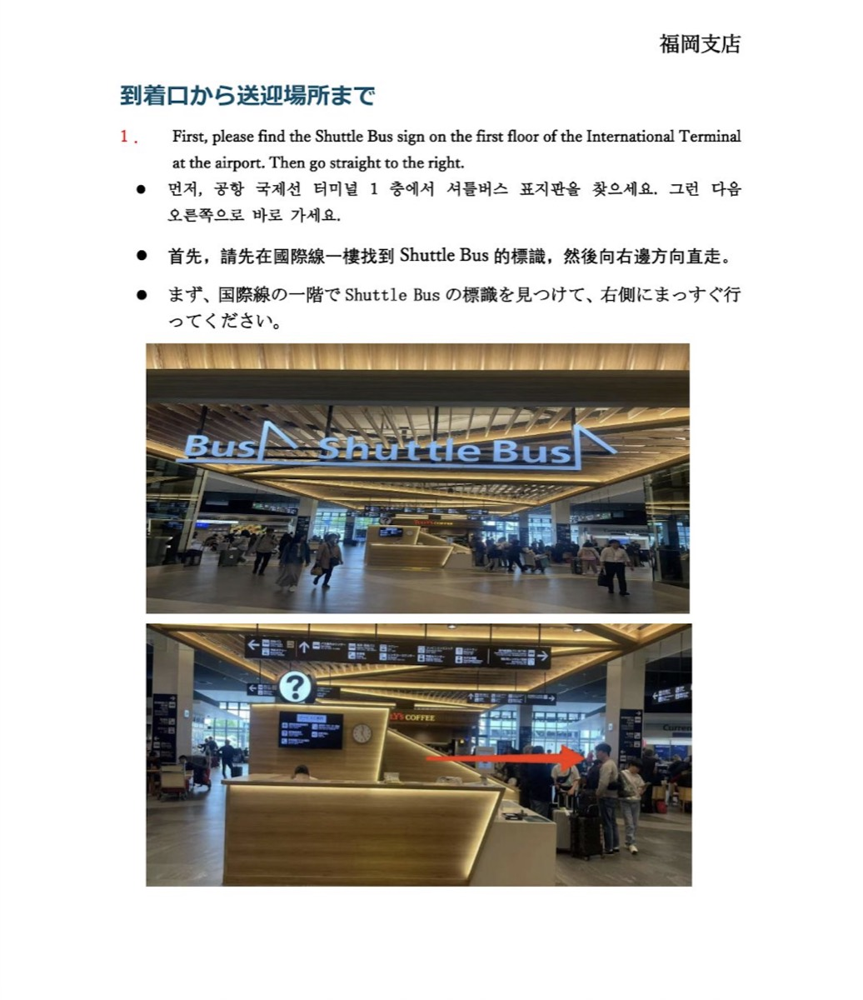
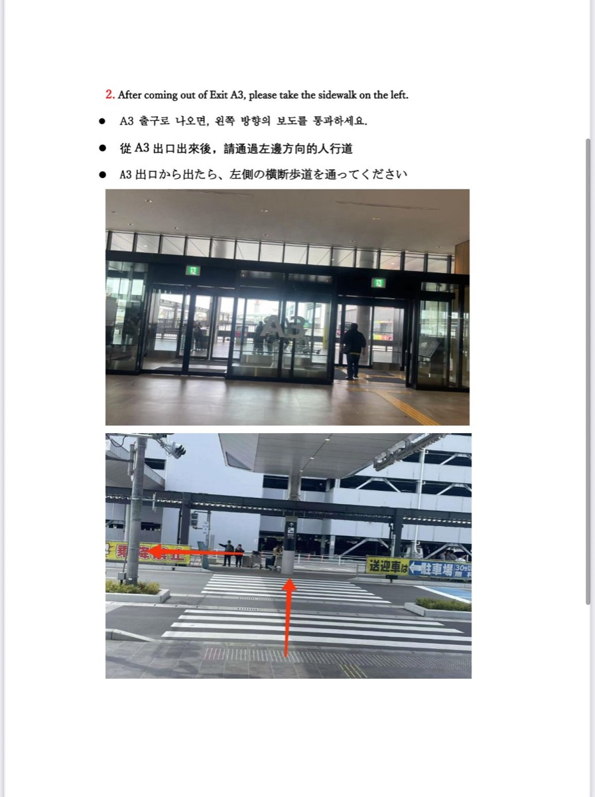
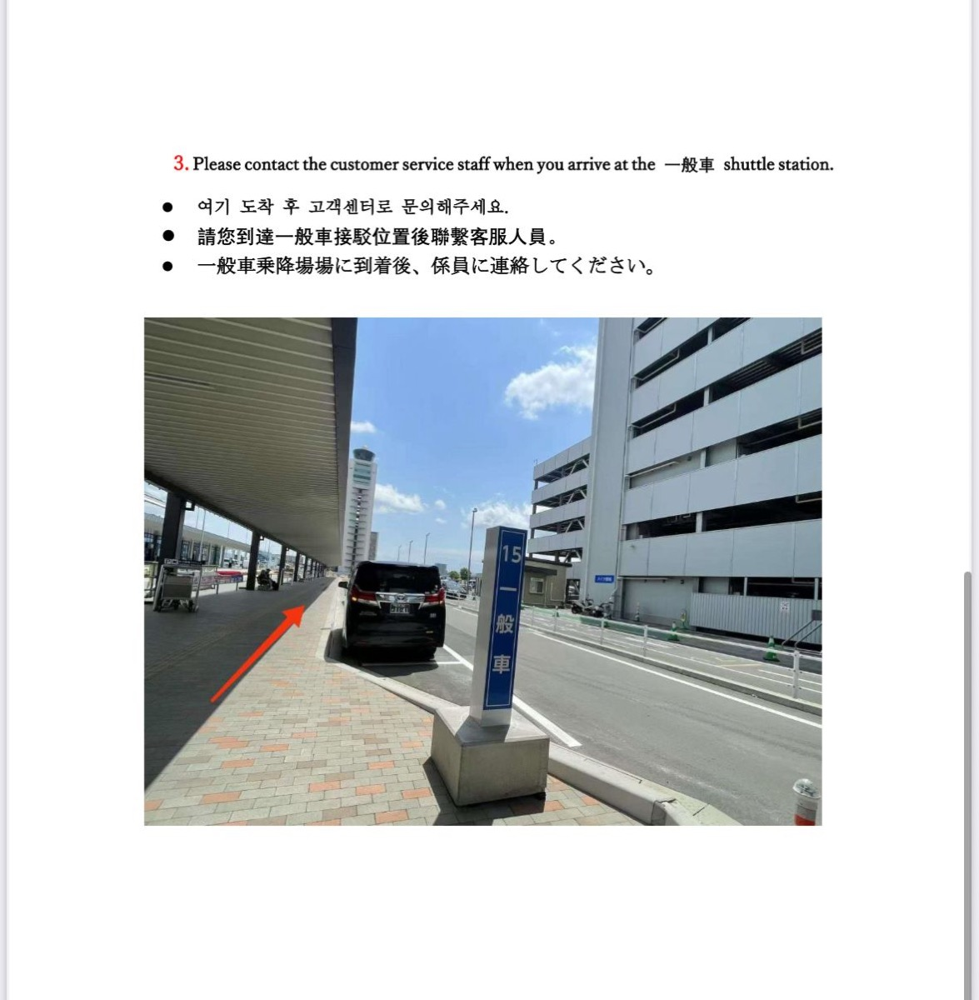
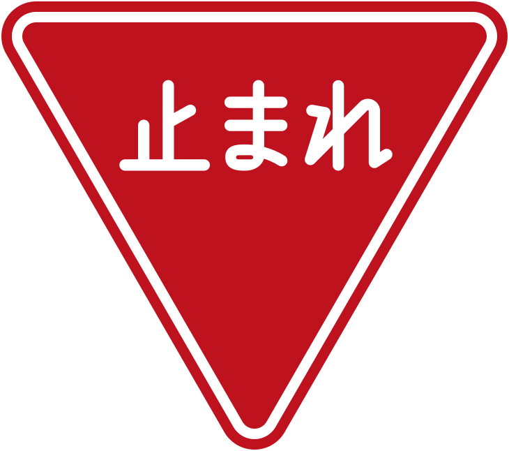
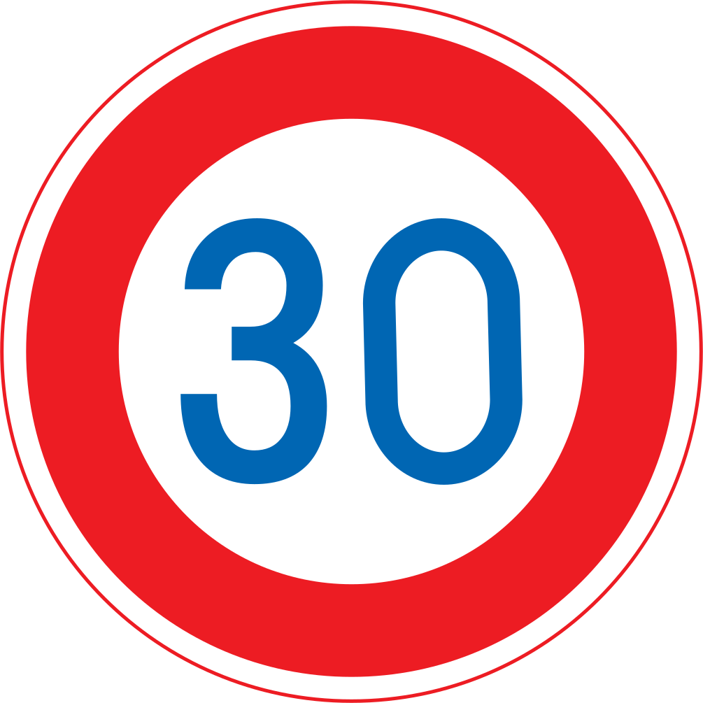
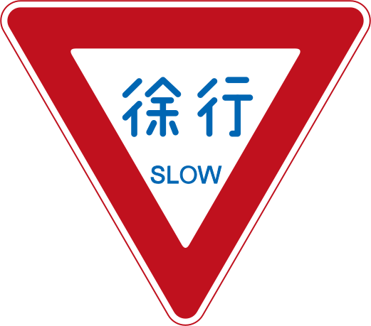
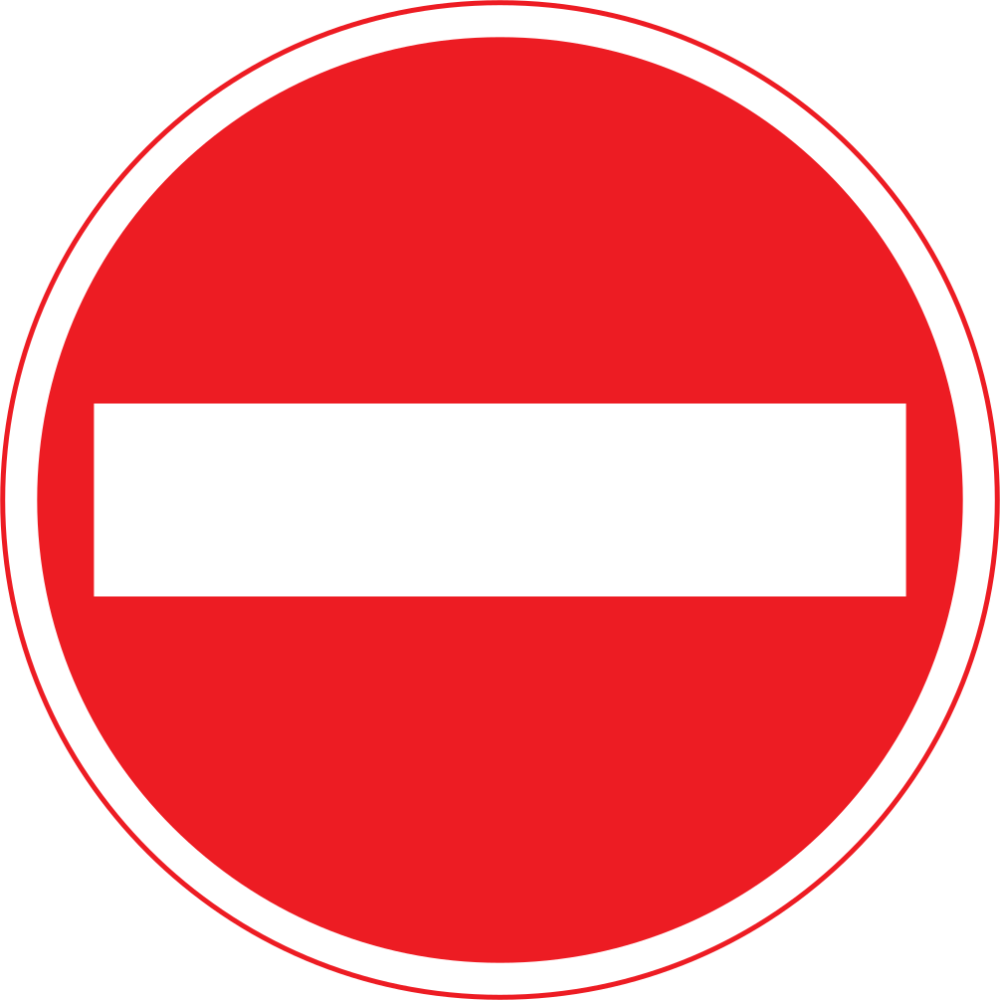
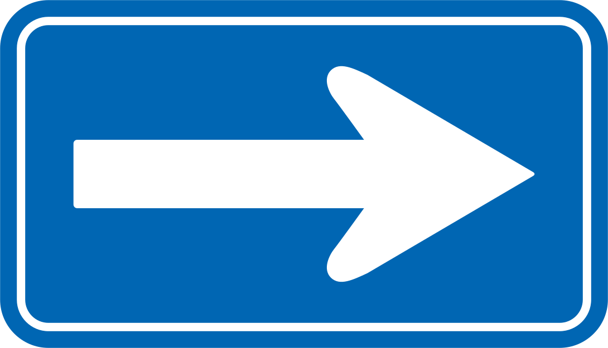
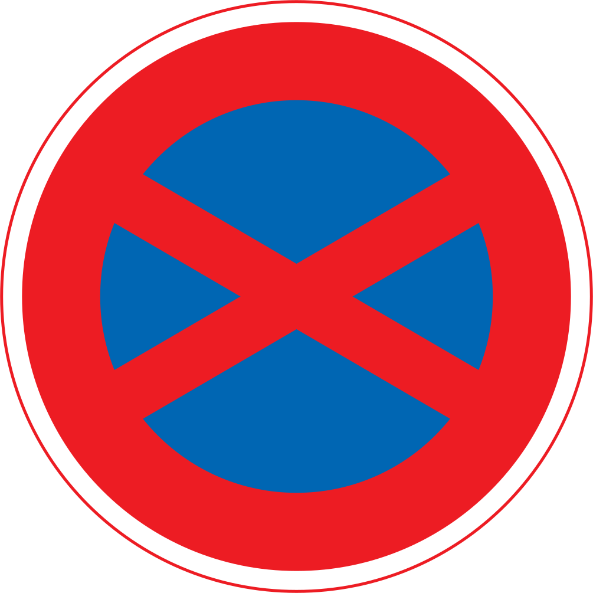
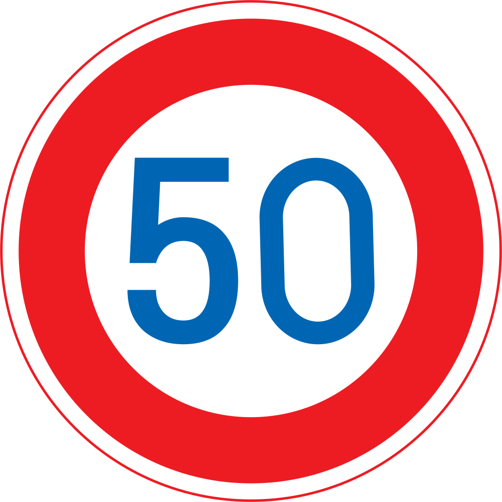

# 福岡九州 7 日自駕行程（旅行紀錄）

> **2026/09/19（六）– 09/25（五）｜2 人｜自駕**
> 福岡 2 晚 → 熊本 2 晚 → 別府 2 晚
>
> 📝 行程已經走完，這份文件記錄**實際走過的版本**。開車規則、市區交通、住宿周邊美食、伴手禮等資訊保留下來，之後可以參考。

---

## 📌 訂單一覽

| 項目 | 編號 | 內容 |
|---|---|---|
| ✈️ 機票 | 訂位代號見 App | CI 0128 / CI 0117 來回 |
| 🚗 租車 | 訂單編號見 Klook App | IX RENTAL — Toyota Aqua 或同級（小型轎車）|
| 🏨 福岡 9/19、9/20 | 確認碼見 Booking App | 中今旅館（混合宿舍上下鋪 × 2 床位，TWD 4,956）|
| 🏨 熊本 9/21、9/22 | 確認碼見 Booking App | 熊本之門酒店（Semi-Private Bunk Bed 2 人房，TWD 4,397）|
| 🏨 別府 9/23、9/24 | 確認碼見 Booking App | Super Hotel 別府駅前（附沙發床雙人房・含早餐，TWD 3,976）|

> 🔒 訂位代號、確認碼、PIN 碼**不寫進這份公開文件**。

---

## 🗺️ 七日路線概覽

| Day | 實際路線 |
|---|---|
| Day 1 | 福岡空港 → IX RENTAL（取車）→ 中今旅館 → やきとり 風林火山（晚餐）|
| Day 2 | 山水水出珈琲 → 糸島（一蘭の森・工房とったん・箱島神社）→ 天神（笑樂・藍瓶・Bic Camera）→ 櫛田神社 → 中洲屋台 → 牛角 |
| Day 3 | 太宰府（星巴克・天滿宮）→ 柳川（万榮堂 鰻魚飯）→ 有明海眺望堤防 → 熊本之門酒店 → しゃぶしゃぶ美山 |
| Day 4 | RHC CAFE → 熊本城 → 城彩苑 → 下通 → KINH DO 金堂 → 永尾剱神社 → 勝烈亭 |
| Day 5 | 米塚 → 草千里（騎馬）→ 中岳火口 → 大觀峰 → 九重"夢"大吊橋 → Super Hotel 別府駅前 → 一蘭 大分弁天店 |
| Day 6 | 由布院（金鱗湖・湯の坪街道）→ 別府地獄めぐり 7 個 → ヤマダデンキ → 焼肉 円円 |
| Day 7 | 別府 → IX RENTAL（還車）→ 福岡空港 → 地鐵到天神（PARCO・SEAM・Bic Camera）→ 福岡空港 |

> 🚗 IX RENTAL 不接受改取／還車時間：9/19 訂單時間沒改，晚上約 19:00 照樣取到車；9/25 照訂單一早還車（9:50 還完），之後搭門市接駁車到機場，再搭地鐵進天神。

---

## 📑 目錄

- [✈️ 機票](#️-機票)
- [🏨 住宿](#-住宿)
- [🚗 租車](#-租車)
- [🅿️ 停車場一覽](#-停車場一覽)
- [🚦 日本自駕規則](#-日本自駕規則第一次開日本車必看)
- [🚇 市區交通（地鐵・市電・巴士）](#-市區交通地鐵市電巴士)
- [🎟️ 門票 & 用餐](#️-門票--用餐)
- [🍜 三間住宿周邊必吃](#-三間住宿周邊必吃)
- [🛍️ 必買紀念品 & 伴手禮](#️-必買紀念品--伴手禮)
- [🛒 採買結果](#-採買結果)
- [📅 每日行程（實際走法）](#-每日行程實際走法)
- [🗺️ 每日路線連結](#️-每日路線連結)
- [💰 預算試算（行前估算）](#-預算試算行前估算)
- [📱 必裝 App](#-必裝-app)
- [📞 緊急聯絡](#-緊急聯絡)

---

## ✈️ 機票

**訂位代號：見電子機票 / App**

| 日期 | 航班 | 起飛 | 抵達 |
|---|---|---|---|
| 9/19（六）| CI 0128 | 14:40 TPE | 18:05 FUK |
| 9/25（五）| CI 0117 | 21:00 FUK | 22:25 TPE |

---

## 🏨 住宿

| 入住日 | 飯店 | 地址 | 房型 / 房價 |
|---|---|---|---|
| 9/19、9/20 | **中今旅館** 🇯🇵 ゲストハウス中今 🇬🇧 GuestHouse Nakaima | 🇯🇵 福岡市博多区冷泉町 6-26（812-0039） 🇬🇧 6-26 Reisenmachi, Hakata-ku, Fukuoka 📞 +81-92-261-5070｜📍 N33 35.642 E130 24.681 | 混合宿舍上下鋪 × 2 床位 / **TWD 4,956**（¥24,800，現場付）|
| 9/21、9/22 | **熊本之門酒店** 🇯🇵 ホテル ザ ゲート熊本 🇬🇧 Hotel The Gate Kumamoto | 🇯🇵 熊本市西区春日 1-14-1（860-0047） 🇬🇧 1-14-1 Kasuga, Nishi-ku, Kumamoto 📞 +81-96-288-0170｜📍 N32 47.419 E130 41.461 | Semi-Private Bunk Bed 2 人房 × 2 晚 / **TWD 4,397**（¥22,000）|
| 9/23、9/24 | **Super Hotel 別府駅前** 🇯🇵 スーパーホテル別府駅前 🇬🇧 Super Hotel Beppu Ekimae | 🇯🇵 大分県別府市駅前町 13-8（874-0935） 🇬🇧 13-8 Ekimaecho, Beppu, Oita 📞 +81-977-73-9000｜📍 N33 16.738 E131 30.058 | 附沙發床雙人房・禁菸・**含早餐** × 2 晚 / **TWD 3,976**（¥19,894）|

> 住宿總價 **TWD 13,329**（每人 ~ TWD 6,665）

> 🗣️ **問路用**：日本人多半看不懂英文地址，**直接把 🇯🇵 那行給對方看**最快；🇬🇧 那行拿來在 Google Maps 搜尋、跟訂房紀錄對照。

### 各家關鍵注意事項

| 飯店 | 入住 / 退房 | 停車 | 一定要知道 |
|---|---|---|---|
| **中今旅館** | 9/19 **15:00–21:00** 入住 9/21 **11:00 前**退房 | ¥500/日，**無法預約**（現場問）| ⚠️ **21:00 後無法 check-in**，已告知抵達時間 20:00–21:00 櫃台 **11:00–15:00 無人**；當日可寄放行李 00:00–07:00 廚房 / 客廳 / 淋浴間停用 全館禁菸（門外有吸菸區）；僅樓梯可上樓 房價含 10% 消費稅；城市稅 ¥200/人/晚現場付 |
| **熊本之門酒店** | 9/21 **15:00–00:00** 入住 9/23 **07:00–10:00** 退房 | ⚠️ **飯店無停車設施**，須停附近付費停車場；地下車位**夜間關閉、無法取車** | 已在特殊要求註明需停車位 **房內禁止用餐**（要用公共休息區） 男女**共用**淋浴間 / 廁所 / 洗手台 9/21 14:00 後取消不退款 |
| **Super Hotel 別府駅前** | 9/23 **15:00–00:00** 入住 9/25 **10:00 前**退房 | 附近私人停車場 ¥500/晚，**先到先停、不能預約** | **含早餐**（三家中唯一） Booking.com 已代付 ¥1,809 住宿方不提供網路 有刺青者公共澡堂可能受限 |

> 💡 中今旅館與熊本之門都是**共用衛浴的青年旅館型住宿**，不是獨立套房；Super Hotel 是一般商務旅館獨立衛浴。

---

## 🚗 租車

**Klook 訂單**（2026/07/11 下單；訂單編號見 Klook App）

| 項目 | 內容 |
|---|---|
| 車型 | **Toyota Aqua 或同級（小型轎車）** — 5 人座 / **2 件行李** / 自排 / 空調 |
| 租車公司 | **IX RENTAL**（Klook 平台訂購）|
| 取/還車門市 | **IX RENTAL 福岡機場店** 🇯🇵 アイエックスレンタカー 福岡支店 🇯🇵 福岡市博多区西月隈 2-4-31（812-0058） 🇬🇧 2-4-31 Nishitsukiguma, Hakata-ku, Fukuoka 📞 +81-80-3226-1688｜📍 福岡空港西南約 2 km |
| 取車 | 訂單 2026/9/19（六）10:00；門市不接受改時間，**實際約 19:00 取車** |
| 還車 | 訂單 2026/9/25（五）10:00；門市不接受延後，**9:30 抵達、9:50 還完車** |
| 接駁 | **無定時接駁車**：取車時到指定的「一般車」乘降場後**打電話**請門市來接（流程見下）；還車後門市開車送到機場 |
| 費用 | **NT$ 6,697**（線上已付）|
| 燃油 / 里程 | 滿油取還車 / 無限里程 |
| 駕駛 | 兩位（訂單含免費 1 位多人駕駛；**兩位都需日文譯本**）|
| 已登記 | 駕駛 MR YANG（年齡 30–65）、航班 CI0128 |

### 🚌 機場 ↔ 門市 接駁流程（門市官方指引）

| Step | 做什麼 | 給日本人看的日文原句 |
|---|---|---|
| 1 | 國際線航廈 **1F** 找到 **「Shuttle Bus」標識**，往**右邊**直走 | 国際線の一階で Shuttle Bus の標識を見つけて、右側にまっすぐ行ってください |
| 2 | 從 **A3 出口**出去，走**左邊**的人行道（過斑馬線）| A3 出口から出たら、左側の横断歩道を通ってください |
| 3 | 抵達 **「一般車」乘降場**（藍色柱 **15** 號）後，**打電話給門市客服**請他們來接 | 一般車乗降場に到着後、係員に連絡してください |

| Step 1 | Step 2 | Step 3 |
|---|---|---|
|  |  |  |
| 1F「Shuttle Bus」標識 → 往右 | A3 出口 → 左邊人行道 | 15 號柱「一般車」→ 打電話 |

> 🖼️ 上圖為 **IX RENTAL 福岡支店官方指引**（日／英／中／韓四語），原檔放在 [`images/`](images/)。

> 📞 接人專線同門市電話 **+81-80-3226-1688**；「一般車」= 一般車輛乘降區，不是巴士站。
> 🚐 還車後門市開接駁車送我們到福岡空港國際線航廈。

### 訂單已包含（不必另外加購）

| 項目 | 狀態 |
|---|---|
| ✅ **ETC 卡** | 已含（高速費按實際里程另付）|
| ✅ **GPS 導航** | 已含 |
| ✅ **多人駕駛** | 已含 1 位免費 |
| ✅ **租車自負額** | **US$ 0** |
| ✅ **車輛竊盜及搶奪保障** | **US$ 0** |
| ✅ **第三人責任險** | 自負額 US$ 1,237 |
| ✅ **營業損失賠償（NOC）** | 理賠上限 US$ 800 |

> 📝 **取／還車時間**：訂單標示「**不可更改**」，門市也不接受協調。9/19 晚上去取車照樣有車；9/25 只能照訂單一早還車，所以 Day 7 一早從別府出發。

> ⚠️ **行李限制只有 2 件**：Aqua 是小型轎車，7 天份行李 + 伴手禮要留意。

### 必備文件
- 台灣駕照正本（兩位駕駛）
- **駕照日文譯本**（兩位駕駛各一份；台灣監理所 NT$100，當天領）
- 護照
- Klook 租車憑證（建議印紙本）

---

## 🅿️ 停車場一覽

> 我們實際停過的地方；費率是 2026/08 行前查證的資料。日本幾乎沒有合法路邊停車，**每個點都要先想好停哪裡**。

| Day | 地點 | 停車場 | 費率 | 備註 |
|---|---|---|---|---|
| 1・2・3早 | **中今旅館** | 旅館自有 | **¥500/日** | 無法預約，現場問櫃台 |
| | ↳ 附近 | **トラストパーク櫛田神社前**（冷泉町 8-4，步行 3 分）| 2 hr ¥500 / 12 hr ¥1,400 | |
| | ↳ 附近 | Times（櫛田神社周邊）| 60 分 ¥200 日間上限 ¥1,500 **夜間 20:00–08:00 上限 ¥600** | 過夜停這種較划算 |
| 2 | **糸島**（一蘭の森・工房とったん・箱島神社）| 各自附設 | **免費** | |
| 2 | **天神** | 天神中央公園的停車場 | — | 晚餐、藍瓶、Bic 都走路，逛完開回中今 |
| 3 | **太宰府** | 太宰府駐車センター | **¥500 一次**（入退場一律）| 850 台、8:00–17:00 |
| 3・4 | **熊本之門酒店** | ⚠️ **飯店無停車場** | 附近 Times 約 30 分 ¥200 **24 hr 上限 ¥1,100–1,200** | Times JR熊本駅ビル第3（步行 2 分）／九州労働金庫熊本駅支店（2 分）／熊本駅前第4（3 分） ⚠️ **地下車位夜間關閉、無法取車** |
| 4 | **熊本城・下通** | SAKURA MACHI Kumamoto 附近的 Times | 依現場 | RHC CAFE、熊本城、城彩苑、下通都走路 |
| 5 | **草千里** | 草千里駐車場 | **¥500/日** | 2024/7 起改**自動攝影記錄 + 後付制**（無人閘門，別以為沒收費就開走）|
| 5 | **大觀峰** | 展望台停車場 | **免費** | |
| 5 | **九重"夢"大吊橋** | 吊橋停車場（中村區約 229 台）| **免費** | 8:30–18:00 |
| 5・6 | **Super Hotel 別府駅前** | 附近私人停車場 | **¥500/晚** | **先到先停、不能預約** |
| 6 | **由布院（金鱗湖・湯の坪街道）** | 周邊民營停車場 | 依現場 | |
| 6 | **別府地獄めぐり**（7 地獄）| 各地獄附設 | **免費** | 鐵輪 5 個停**海地獄**走路串連；柴石 2 個開車約 10 分，停**血の池地獄** |

> 💡 **投幣停車場怎麼用**：車輪下擋板升起 → 離開前到繳費機**輸入車位號碼**付款 → 擋板降下才能開走。忘記付款開不走。

---

## 🚦 日本自駕規則（第一次開日本車必看）

> 📅 2026/08 查證。**我們 9/19 出發，正好在 2026/9/1 新制上路之後**，速限規則跟以前的攻略文不一樣。

### 🚨 2026/9/1 新制：生活道路法定速度 60 → **30 km/h**

**沒有中央線（分隔線）的一般道路，未特別標示時，法定速度就是 30 km/h。**

| 項目 | 內容 |
|---|---|
| 施行日 | **2026/9/1**（我們出發前 18 天）|
| 對象 | **沒有中央線／中央分隔島**的道路，多為**寬度未滿 5.5 m** 的窄路 |
| 範圍 | 全國國道・都道府県道・市町村道的**約 7 成** |
| 舊制 | 無標誌時原則 60 km/h |

> ⚠️ **對我們的實際影響**：博多冷泉町老街巷弄、糸島鄉間小路、柳川市區、別府北浜巷弄 —— 這些路以前沒標誌可跑 60，**現在預設 30**。看到路面沒有中央線就自動降到 30，最安全。

### 📄 三份文件缺一不可

| 文件 | 說明 |
|---|---|
| ✅ **台灣駕照正本** | 影本無效 |
| ✅ **駕照日文譯本** | 台灣監理所申請 NT$100，當天領。**不是國際駕照**（日本不承認台灣的國際駕照）|
| ✅ **護照** | 三者缺一，租車公司直接拒絕交車 |

> 兩位駕駛**各自**都要備齊三份。

### 🚸 一定要看懂的號誌

| 號誌 | 日文 | 意思 |
|---|---|---|
|  | **止まれ** | **完全停止 3 秒**（紅色倒三角）|
|  | **最高速度** | 圈內數字 = 速限上限；無標誌的窄路預設 30 |
|  | **徐行 / SLOW** | 減速到隨時能停（約 10 km/h）|
|  | **車両進入禁止** | 禁止進入（多為單行道逆向）|
|  | **一方通行** | 單行道，只能往箭頭方向 |
|  | **駐車禁止** | 禁止停車，可短暫上下客 |
|  | **駐停車禁止** | 連停下來都不行（斜線交叉 = 更嚴）|
|  | **最高速度 50** | 標誌永遠優先於法定速度 |

> 💡 **藍底 = 指示（可以做）、紅圈 = 禁止、紅色倒三角 = 停下來** —— 記這三個顏色規則就能猜對八成。

> 📜 號誌圖為日本《道路標識、區劃線及道路標示相關命令》的法定圖形，屬公共領域（著作權法第 13 條）；SVG 取自 Wikimedia Commons（Public domain）。

### 🇯🇵 台灣人最容易犯的 5 件事

| # | 事項 | 說明 |
|---|---|---|
| 1 | **靠左行駛・右駕** | 方向盤在右、車走左側。**最容易出錯的是右轉**（切到對向）與**出停車場**時 |
| 2 | **雨刷 ↔ 方向燈相反** | 日本車雨刷在左、方向燈在右，跟台灣相反。前三天一定會打錯，習慣就好 |
| 3 | **「止まれ」必須完全停止** | 紅色**倒三角**標誌 + 路面「止まれ」，**輪子要停死 3 秒**再走，滑行過去就是違規。日本無號誌路口極多、取締也多 |
| 4 | **行人絕對優先** | 斑馬線前有人（含在等的人）**一定要停**，近年取締非常嚴。日本駕駛都會停，跟著停就對了 |
| 5 | **鐵路平交道一律停車** | 不管有沒有柵欄、有沒有車，**都要停下確認左右**再過 |

### 🚗 速限

| 道路 | 法定速度 |
|---|---|
| **高速公路** | **100 km/h**（部分區間 120；一律依現場標誌）|
| 一般道路（有中央線）| 60 km/h |
| **生活道路（無中央線）** | **30 km/h**（2026/9/1 起）|
| 標誌有寫 | **以標誌為準**（標誌 > 法定）|

> 📷 日本測速照相（オービス）與埋伏取締都不少，九州道尤其常見。**超速 30 km/h 以上可能直接吊照 + 刑事罰**，不值得。

### ⛔ 絕對不能做

| 違規 | 後果 |
|---|---|
| 🍺 **酒駕** | 酒氣帶：**3 年以下拘禁刑或 50 萬日圓罰金**；酒醉：**5 年以下拘禁刑或 100 萬日圓罰金** |
| 🍺 **搭酒駕者的車** | **同乘者也會被罰**（道交法 65 條）；提供車輛、提供酒給駕駛者同樣有罪 |
| 📱 **開車用手機** | 2019 年起罰則大幅加重，拿在手上就違規；導航要看請靠邊停 |
| 🚸 **不繫安全帶** | **後座也必須繫**，包含高速與市區 |

> 💡 **日本是零容忍**：喝一口都算。晚餐要喝酒就把車留在飯店停車場，隔天再開。

### ⛽ 加油（**加錯油會毀引擎**）

| 日文 | 是什麼 | 我們的車 |
|---|---|---|
| **レギュラー**（Regular）| 一般無鉛汽油 | ✅ **Toyota Aqua 加這個** |
| ハイオク（High-oct）| 高級汽油 | ❌ 不需要 |
| **軽油** | ⚠️ **柴油！不是汽油** | ❌ **絕對不能加**，加了引擎報銷 |

> ⚠️ 「軽油」看起來像「輕的油」，是台灣人最常加錯的一項。**認 レギュラー（紅色油槍）就對了**。
> 🈵 租車合約是**滿油取還**，還車前找加油站加滿並保留收據。
> 🗣️ 自助加油站說「レギュラー、満タン（man-tan）」= 一般汽油加滿。

### 🅿️ 停車

- **路邊停車＝違規**（日本幾乎沒有合法路邊停車），一律停 **コインパーキング**（投幣停車場）
- 常見機制：車輪下的擋板升起 → 離開前到繳費機輸入車位號碼付款 → 擋板降下才能開走
- 觀光地停車場多為 ¥500/次，市區按時計費
- 熊本之門酒店**沒有自己的停車場**，要另找附近付費停車場

### 🛣️ 高速公路

- **ETC 卡已含在租車訂單內**，走 ETC 車道（紫色標示），**時速降到 20 km/h 以下**通過
- **左側是行車道、右側是超車道** —— 超完車要回左道，一直佔右道會被取締
- SA（服務區）/ PA（停車區）都有廁所、餐廳，**九州道約每 20–30 km 一個**
- 連假（9/19–9/23）塞車嚴重，車程抓平常 1.5 倍

### 🆘 出事怎麼辦

| 狀況 | 打給誰 |
|---|---|
| 事故（有人受傷）| **119**（救護）+ **110**（警察）|
| 事故（無人受傷）| **110** — 日本**一定要報警**才有事故證明，否則保險不理賠 |
| 車輛故障 / 沒電 / 爆胎 | **JAF #8139**（24h）|
| 任何情況都要打 | **IX RENTAL +81-80-3226-1688** |

> 📋 我們的保險：**租車自負額 US$0**、車輛竊盜 US$0、第三人責任險（自負額 US$1,237）、NOC 營業損失賠償上限 US$800 —— 已全包在訂單內。
> ⚠️ 但**肇事逃逸、酒駕、無照**等情況保險一律不理賠。

---

## 🚇 市區交通（地鐵・市電・巴士）

> 本行程 **9/19 傍晚取車 → 9/25 上午還車**，中間全程自駕。Day 7 還車後靠地鐵：福岡空港 → 天神採買 → 回機場。市區夜間移動、喝酒不開車時也用得到。
> 📅 以下為 **2026/08 查證**的現況，票價可能調整。

### 🌸 福岡市地下鐵（福岡市地下鉄 / Fukuoka City Subway）

三條線，觀光幾乎只會用到空港線。

| 路線 | 日文 / English | 區間 | 對我們的用途 |
|---|---|---|---|
| **機場線** | 空港線（1號線）/ Kuko Line | 福岡空港 ↔ 博多 ↔ 天神 ↔ 姪浜 | **主力**：機場、博多站、天神、中洲川端 |
| **箱崎線** | 箱崎線（2號線）/ Hakozaki Line | 中洲川端 ↔ 貝塚 | 幾乎用不到 |
| **七隈線** | 七隈線（3號線）/ Nanakuma Line | 橋本 ↔ 天神南 ↔ **博多** | 2023 延伸到博多站；去藥院、大濠方向 |

| 項目 | 內容 |
|---|---|
| 🎫 **福岡空港 → 博多站** | **¥260 / 約 5 分**（空港線 2 站）|
| ⚠️ **國際線航廈沒有地鐵站** | 要先搭**免費連絡巴士**到國內線航廈（約 10 分）再轉地鐵，**全程約 20 分** |
| 🎟️ **一日乘車券** | **¥640**（全線一日不限次；兒童 ¥320）|
| 💳 IC 卡 | Suica / PASMO / ICOCA 等全國互通卡都能直接刷 |
| 🕐 班距 | 白天約 5–8 分一班 |

> 🚕 **Day 1 用不到地鐵**：我們是出國際線後直接走去 IX RENTAL 的一般車乘降場等接駁。
> 💡 **中今旅館最近的站是「中洲川端駅」（空港線・箱崎線）**，步行約 5 分；博多站搭地鐵 1 站即到。

### 🐻 熊本市電（熊本市電 / Kumamoto City Tram）

熊本**沒有地鐵**，市區靠路面電車（市電）+ JR。

| 系統 | 日文 / English | 區間 |
|---|---|---|
| **A 系統** | Ａ系統 / Line A | **田崎橋 ↔ 熊本駅前 ↔ 辛島町 ↔ 熊本城・市役所前 ↔ 健軍町** |
| **B 系統** | Ｂ系統 / Line B | 上熊本 ↔ 辛島町 ↔ 健軍町 |

| 項目 | 內容 |
|---|---|
| 🎫 車資 | **大人均一 ¥200**、兒童 ¥100（2025/6 起調整，2026 仍適用）|
| 🎟️ 一日乘車券 | 紙本 **¥700**；**手機版較便宜**（熊本市交通局 App / 九州 MaaS）|
| 🏯 **熊本駅前 → 熊本城・市役所前** | 搭 **A 系統**，約 10 分、¥200 |
| ⚠️ 轉乘 | 上熊本方向（B 系統）↔ 田崎橋方向（A 系統）要在 **辛島町** 換車 |

> 💡 **熊本之門酒店就在熊本駅東口（白川口）步行 1 分**（熊本森都心プラザ 1F），走到「熊本駅前」電停即可上車 — 去熊本城不想找停車位的話，市電是省事的選項（城彩苑旁就是電停）。

### ♨️ 別府（Beppu）

別府**沒有地鐵也沒有市電**，靠 **龜之井巴士（亀の井バス / Kamenoi Bus）** + JR 日豐本線。

| 項目 | 內容 |
|---|---|
| 🚌 主要業者 | 龜之井巴士 — 別府駅 / 別府駅西口 / 鐵輪 為主要轉運點 |
| 🎟️ 一日券 | **My Beppu Free（マイべっぷフリー）迷你版**：別府市內（含鐵輪・地獄巡迴區）一日不限次 — 價格以官網或九州 MaaS 為準 |
| 🚉 JR | 日豐本線 別府 ↔ 大分 約 12 分 |
| 🅿️ 我們的情況 | Super Hotel 就在**別府駅前**，鐵輪走 Day 6 自駕即可，巴士只是備援 |

---

## 🎟️ 門票 & 用餐

### 🍽️ 用餐：**全程沒預約，都是現場**

> 連假期間（9/19–9/23）也沒訂位。唯一撲空的是 Day 3 柳川御花的鰻魚飯（客滿），改吃同在柳川的万榮堂。

### 門票（成人單張，2026/08 行前查證）

| 景點 | 門票 | 備註 |
|---|---|---|
| **熊本城**（Day 4）| ¥800 | 高中以上；9:00–17:00（最終入園 16:00）|
| **九重"夢"大吊橋**（Day 5）| ¥500 | 國中生以上；8:30–18:00（售票至 17:30）|
| **別府地獄めぐり**（Day 6，7 地獄共通券）| ¥2,400 | 8:00–17:00；單館 ¥450 |

### 免費

- 箱島神社、太宰府天滿宮、城彩苑、永尾剱神社、米塚、草千里浜（停車 ¥500）、大觀峰、金鱗湖、由布院湯の坪街道

---

## 🍜 三間住宿周邊必吃

### 🏨 福岡 中今旅館 周邊（博多区冷泉町）

> 中今旅館位於博多老街冷泉町，**步行 3 分到櫛田神社、川端商店街**，5–10 分到中洲、博多運河城

| 必吃 | 地址 / 提醒 |
|---|---|
| **一蘭 本社總本店**（24h）| 博多区中洲 5-3-2；本社限定「重箱」吃法（Day 2 吃過一蘭の森，可跳過）|
| **博多もつ鍋 おおやま 本店** | 博多区中洲 3-7-24；醬油味噌湯頭都神 |
| **博多もつ鍋 笑樂 本店** ✅ Day 2 吃過 | 中央区西中洲 11-4 |
| **水炊き 橙**（中洲）| 博多区中洲 5-3-8；雞湯系名店 |
| **水炊き 若杉 本店** | 博多区奈良屋町 8-12（旅館步行 7 分）|
| **元祖博多めんたい重** | 中央区西中洲 6-15；明太子米飯重 |
| **博多運河城 Ramen Stadium** | 5F 拉麵主題集合 |
| **食堂 おわん** | 博多区冷泉町 9-20 1F（旅館步行 2 分）；土鍋炊飯早餐 7:30–10:00（L.O. 9:30）|
| **川端ぜんざい広場** | 川端商店街內，紅豆湯名店（旅館步行 3 分）|

### 🏨 熊本 熊本之門酒店 周邊（西区春日，熊本駅東口）

> 飯店就在**熊本駅東口（白川口）步行 1 分**（熊本森都心プラザ 1F），JR / 市電 / アミュプラザ 都在步行範圍

| 必吃 | 地址 / 提醒 |
|---|---|
| **菅乃屋 熊本駅店**（馬肉專門）| 熊本駅內（飯店步行 5 分）；馬刺身 / 馬肉壽司 / 烤馬肉膳 |
| **勝烈亭 新市街本店**（炸豬排）| 中央区新市街 8-18 |
| **桂花拉麵 本店** | 中央区花畑町 11-9；熊本豚骨元祖之一 |
| **天外天 本店**（拉麵）| 中央区安政町 |
| **黒亭 本店**（拉麵）| 西区二本木 2-1-23（飯店步行 8 分）；熊本拉麵名店 |
| **大關馬肉**（馬肉料理）| 中央区下通；熟食 / 馬肉醬煮 |
| **いきなり団子** | 路邊小吃 / 熊本駅內物產館；地瓜紅豆糕，名物 |

### 🏨 別府 Super Hotel 別府駅前 周邊（駅前町）

> 飯店就在**別府站前**，步行 1–2 分到車站、5 分到北浜海岸、10 分到別府塔

| 必吃 | 地址 / 提醒 |
|---|---|
| **とよ常 本店**（天婦羅）| 北浜 2-12-24；特上天丼 ¥980 銅板神店 |
| **冷麺の胡月**（別府冷麺名店）| 石垣東 8-1-26；週二休、**週三只到 17:30** |
| **お食事處 千成**（鄉土料理）| 北浜 1-9-2（步行 6 分）|
| **東洋軒 別府本店**（炸雞元祖）| 石垣東 7-8-22；大分炸雞發源 |
| **岡本屋売店**（明礬）| 明礬 3 組；8:30–18:30（L.O. 17:30）；地獄蒸布丁、溫泉蛋 |
| **べっぷ駅市場** | 別府站旁（步行 3 分）；當地早餐、関アジ握り |
| **甘味茶屋**（だんご汁）| 実相寺 1-4；大分鄉土麵食 |
| **友永パン屋**（百年麵包店）| 千代町 2-29；當地人早餐 |

---

## 🛍️ 必買紀念品 & 伴手禮

### 🥢 福岡 / 博多

| 品項 | 推薦 | 哪裡買 |
|---|---|---|
| **明太子**（最名物）| ふくや / やまや / 博多あごおとし | 博多阪急 B1、博多デイトス、機場 |
| **博多通りもん** | 西洋風白餡饅頭（必買）| 全部物產店都有 |
| **二○加煎餅** | 福岡老舖煎餅 | 博多デイトス、機場 |
| **博多ぽてと** | 紫芋蛋糕 | 博多デイトス |
| **鶴乃子**（石村萬盛堂）| 白蛋黃棉花糖 | 博多老舖 |
| **博多もつ鍋 真空包** | 帶回家煮 | おおやま、笑樂 公式店 |
| **明月堂 博多通りもんアイス**（夏季限定）| 通りもん冰淇淋 | 機場 |

### 🐴 熊本

| 品項 | 推薦 | 哪裡買 |
|---|---|---|
| **馬肉商品** | 馬肉味噌、馬肉ジャーキー、馬刺し醬油 | 城彩苑、熊本駅物產館 |
| **いきなり団子（真空版）** | 地瓜紅豆糕禮盒 | 城彩苑、熊本駅 |
| **誠味屋 陣太鼓** | 紅豆羊羹名菓 | 城彩苑、熊本駅 |
| **くまモン周邊** | 玩偶、文具、零食 | 鶴屋百貨 東館 1F「くまモンスクエア」、城彩苑、機場 |
| **球磨燒酎** | 米焼酎，送禮佳品 | 熊本駅物產館 |
| **天草鹽** / **阿蘇牛乳製品** | 餅乾、起司 | 道の駅 阿蘇 |

### ♨️ 別府 / 大分

| 品項 | 推薦 | 哪裡買 |
|---|---|---|
| **湯花入浴劑**（湯之花）| **明礬湯之里限定**，硫磺溫泉粉 | 明礬湯之里現場、別府站 |
| **岡本屋 地獄蒸布丁** | 在地名物 | 明礬 岡本屋売店（不耐放，當天吃）|
| **かぼす（臭橙）製品** | 果汁、ぽん酢、果凍 | 別府站、道の駅 |
| **椎茸乾貨** | 大分名物 | 別府站、道の駅 |
| **関アジ・関サバ 加工品** | 一夜干、罐頭 | 別府站、福岡空港 |
| **由布院 B-speak ロールケーキ** | 鮮奶蛋糕卷（限購、當天吃）| 湯之坪商店街 |
| **Snoopy 茶屋限定品** | 由布院店限定 | 湯之坪商店街 |
| **湯けむり饅頭** | 別府限定饅頭 | 別府站 |

---

## 🛒 採買結果

### 🔌 行前清單（家電・周邊）

| # | 品項 | 型號 | 結果 | 在哪買 |
|---|---|---|---|---|
| 1 | **吹風機** | Panasonic **EH-NE7N** | ✅ 買到 | Day 2 Bic Camera 天神 |
| 2 | **刮鬍刀**（給爸爸）| Panasonic ラムダッシュ パームイン **ES-PV3A**（掌上型 5 枚刃，ES-PV6A 同款）| ✅ 買到 | Day 2 Bic Camera 天神 |
| 3 | **塵蟎機**（白色）| アイリスオーヤマ 布団クリーナー **FCA-A3-W** | ✅ 買到 | Day 6 ヤマダデンキ テックランド別府駅前店 |
| 4 | **滑鼠墊** | ARTISAN（アーチサン）NINJA FX ゼロ／飛燕 | ❌ 沒買到 | |
| 5 | **滑鼠** | Pulsar（パルサー）X2V2／Xlite 系列 | ❌ 沒買到 | |

> ⚡ **電壓**：吹風機 EH-NE7N 日本版官方規格是 **AC100V**；刮鬍刀是 **AC100–240V 自動切換**。

### 🎁 其他戰利品

| Day | 品項 | 在哪買 |
|---|---|---|
| 2 | 藍瓶 **天神限定杯** | 藍瓶咖啡 福岡天神 |
| 4 | 襪子 | 靴下屋 Life and Feel 熊本下通り店 |
| 4 | 手帕（給小孩當口水巾，材質剛好）| 下通的文具店 |
| 7 | **吉伊卡哇** 騎乘款| 福岡PARCO 本館 |
| 7 | **海賊王**：懸賞令、布魯克人形立牌、抽卡（1/12 機率）抽到魯夫 | 麦わらストア 福岡店（福岡PARCO 本館 7F）|
| 7 | **SK-II 保養套裝**（給老婆、媽媽）| 天神 |
| 7 | 潤髮乳 | SEAM 天神大名店 |
| 7 | 藥妝 | 大國藥妝（SEAM 隔壁）|
| 7 | **寶可夢卡 烈空坐限定版**（一人限購 10 張，兩人共 20 張）、電競冰絲袖套 | Bic Camera 天神 2 号館 |
| 7 | **PORTER 皮夾**（給岳父）| 福岡空港 國際線 出境後 |

> 明太子、博多通りもん這次都沒買。

---

## 📅 每日行程（實際走法）

> 依實際走的順序列出；查得到的地址都附上，Google Maps 路線整理在「每日路線連結」。

---

### Day 1｜9/19（六）抵達日｜🏨 中今旅館

**路線**：福岡空港 → IX RENTAL 福岡機場店（取車）→ 中今旅館 → やきとり 風林火山 5号店

| # | 去了哪 | 地址 / 備註 |
|---|---|---|
| 1 | **福岡空港 國際線航廈** 🇯🇵 福岡空港 国際線ターミナル | 福岡市博多区下臼井 778-1｜18:05 CI0128 抵達 |
| 2 | **IX RENTAL 福岡機場店**（取車） 🇯🇵 アイエックスレンタカー 福岡支店 | 福岡市博多区西月隈 2-4-31｜到「一般車」乘降場打電話叫接駁，**約 19:00 取車** |
| 3 | **中今旅館** 🇯🇵 ゲストハウス中今 | 福岡市博多区冷泉町 6-26 |
| 4 | **やきとり 風林火山 5号店**（晚餐・燒鳥）| 福岡市博多区博多駅前 2-3-26｜JR 博多站步行約 2 分（[tabelog](https://tabelog.com/fukuoka/A4001/A400101/40024712/)）|

> 📝 IX RENTAL 不接受改時間，訂單上的 10:00 沒改成，晚上到門市照樣取到車。

---

### Day 2｜9/20（日）糸島 → 天神 → 中洲｜🏨 中今旅館

**路線**：山水水出珈琲 → 一蘭の森 → 工房とったん → 箱島神社 → 天神（笑樂・藍瓶・Bic Camera）→ 中今旅館 → 櫛田神社 → 中洲屋台 → 牛角

| # | 去了哪 | 地址 / 備註 |
|---|---|---|
| 1 | **山水水出珈琲**（早餐）| 福岡市博多区下川端町 3-1 博多リバレイン 1F｜旅館步行 3–5 分 |
| 2 | **一蘭の森** | 福岡県糸島市志摩松隈 256-10 |
| 3 | **工房とったん**（またいちの塩）| 福岡県糸島市志摩芥屋 3757 |
| 4 | **箱島神社** | 福岡県糸島市志摩桜井 |
| 5 | **天神**：車停天神中央公園的停車場 | |
| 6 | **博多もつ鍋 笑樂 本店**（晚餐）| 福岡市中央区西中洲 11-4｜もつ鍋，加點了馬肉 |
| 7 | **藍瓶咖啡 福岡天神** 🇯🇵 ブルーボトルコーヒー 福岡天神カフェ | 福岡市中央区天神 2-2-20｜買了**天神限定杯** |
| 8 | **Bic Camera 天神** 1・2 号館 | 1 号館 今泉 1-25-1／2 号館 天神 2-4-5｜買了吹風機、刮鬍刀（見 [採買結果](#-採買結果)）|
| 9 | 開回**中今旅館**停車 | |
| 10 | **櫛田神社**（步行）| 中今旅館步行約 3 分 |
| 11 | **中洲屋台**（步行）| 中洲 |
| 12 | **牛角**（燒肉）| 中洲 Gate's 旁 |

> 📝 原本排的夫婦岩 二見ヶ浦沒去，箱島神社之後就回福岡市區。

---

### Day 3｜9/21（一・敬老日）福岡 → 太宰府 → 柳川 → 熊本｜🏨 熊本之門酒店

**路線**：中今旅館 → 太宰府（星巴克・天滿宮）→ 柳川（万榮堂）→ 有明海眺望堤防 → 熊本之門酒店 → しゃぶしゃぶ美山

| # | 去了哪 | 地址 / 備註 |
|---|---|---|
| 1 | **7-11**（早餐）| 買飯糰路上吃 |
| 2 | **星巴克 太宰府天滿宮表參道店** 🇯🇵 スターバックス 太宰府天満宮表参道店 | 福岡県太宰府市宰府 3-2-43｜隈研吾設計 |
| 3 | **太宰府天滿宮** | 門口跟**御神牛**拍照；參道吃**梅ヶ枝餅**（烤麻糬包紅豆餡）|
| 4 | **万榮堂**（午餐・鰻魚飯）| 福岡県柳川市｜原本要吃的御花客滿，改吃這家 |
| 5 | **有明海眺望堤防** | 柳川沿海｜Google Maps 搜「有明海眺望堤防」|
| 6 | **熊本之門酒店** 🇯🇵 ホテル ザ ゲート熊本 | 熊本市西区春日 1-14-1 |
| 7 | **しゃぶしゃぶ美山 アミュプラザくまもと店**（晚餐）| アミュプラザくまもと 7F（熊本駅直結）｜一人一鍋，類似台灣的涮涮鍋 |

---

### Day 4｜9/22（二・國民休日）熊本市區 → 永尾剱神社｜🏨 熊本之門酒店

**路線**：SAKURA MACHI Kumamoto（RHC CAFE）→ 熊本城 → 城彩苑 → 下通 → KINH DO 金堂 → 永尾剱神社 → 勝烈亭

| # | 去了哪 | 地址 / 備註 |
|---|---|---|
| 1 | 車停 **SAKURA MACHI Kumamoto** 附近的 Times | 熊本城旁的購物中心 |
| 2 | **RHC CAFE**（早餐）| SAKURA MACHI Kumamoto 1F｜10:00 開門就進去 |
| 3 | **熊本城** | 熊本市中央区本丸 1-1 |
| 4 | **櫻之馬場 城彩苑** 🇯🇵 桜の馬場 城彩苑 | 熊本市中央区二之丸 1-1-2 |
| 5 | **下通**：靴下屋 Life and Feel 熊本下通り店 | 熊本市中央区手取本町 4-4-5｜買襪子（[下通公式](https://shimotoori.com/shop/kutsushitaya/)）|
| 6 | **下通**：文具店 | 買手帕給小孩當口水巾 |
| 7 | **KINH DO - 金堂**（午餐・越南料理）| 下通一帶｜[Google Maps](https://maps.app.goo.gl/vm5ss6n5dcMvVAX26) |
| 8 | **永尾剱神社**（海中鳥居）| 開車過去，看海、逛神社｜[Google Maps](https://maps.app.goo.gl/arhLQSAsZbgLQuw19) |
| 9 | **とんかつ勝烈亭 アミュプラザくまもと店**（晚餐）| アミュプラザくまもと 7F（熊本駅直結）|

---

### Day 5｜9/23（三・秋分日）熊本 → 阿蘇 → 九重 → 別府｜🏨 Super Hotel 別府駅前

**路線**：熊本之門酒店 → 米塚 → 草千里（早餐・騎馬）→ 中岳火口 → 大觀峰 → 九重"夢"大吊橋 → Super Hotel 別府駅前 → 一蘭 大分弁天店

| # | 去了哪 | 地址 / 備註 |
|---|---|---|
| 1 | **米塚** | 熊本県阿蘇市｜圓錐形小火山 |
| 2 | **草千里**：休息區吃早餐 | 草千里停車場旁那排連棟商店 |
| 3 | **草千里 騎馬** | 草千里入口處｜10:00 一開就騎，下馬後在草千里散步 |
| 4 | **中岳火口** | 火口入口封閉，開車到外面的停車場繞一圈 |
| 5 | **大觀峰** | 熊本県阿蘇市｜阿蘇五岳全景 |
| 6 | **九重"夢"大吊橋** | 大分県玖珠郡九重町田野 1208 |
| 7 | **Super Hotel 別府駅前**（停車、check-in）| 大分県別府市駅前町 13-8 |
| 8 | **一蘭 大分弁天店**（晚餐）| 大分県大分市弁天 3-5-1｜從別府開車過去 |

> 🌋 9 月下旬阿蘇噴火警戒等級 2（火口周邊規制），中岳火口不開放；草千里、大觀峰照常。

---

### Day 6｜9/24（四）由布院 → 別府地獄めぐり｜🏨 Super Hotel 別府駅前

**路線**：Super Hotel 別府駅前 → 金鱗湖 → 湯の坪街道 → 鐵輪 5 地獄 → 柴石 2 地獄 → Super Hotel 別府駅前 → ヤマダデンキ → 焼肉 円円

| # | 去了哪 | 地址 / 備註 |
|---|---|---|
| 1 | **金鱗湖** | 大分県由布市湯布院町川上 1561-1 |
| 2 | **湯の坪街道** | 大分県由布市湯布院町 |
| 3 | **別府地獄めぐり 鐵輪 5 地獄**：海・鬼石坊主・かまど・鬼山・白池 | 車停**海地獄**（別府市大字鉄輪 559-1），走路串連 |
| 4 | **別府地獄めぐり 柴石 2 地獄**：血の池・龍巻 | 別府市野田｜走回海地獄取車開過去，停**血の池地獄**停車場 |
| 5 | 回飯店休息 | |
| 6 | **ヤマダデンキ テックランド別府駅前店** | 別府駅旁（約 100 m）｜買 IRIS 塵蟎機 FCA-A3-W |
| 7 | **焼肉 円円**（晚餐）| 大分県別府市北浜 1-746-15｜別府駅往海邊走約 5 分 |

> 💴 地獄 7 個共通券 ¥2,400（單館 ¥450）。

---

### Day 7｜9/25（五）回國日｜別府 → 還車 → 天神 → 機場

**路線**：Super Hotel 別府駅前 → IX RENTAL（還車）→ 福岡空港（寄行李）→ 地鐵到天神 → 福岡PARCO → SEAM・大國藥妝 → Bic Camera 天神 2 号館 → 福岡空港

| # | 去了哪 | 地址 / 備註 |
|---|---|---|
| 1 | 一早從別府出發 | 路上在便利商店買東西吃 |
| 2 | **IX RENTAL 福岡機場店**（還車）| 福岡市博多区西月隈 2-4-31｜9:30 抵達、9:50 還完 |
| 3 | **福岡空港 國際線航廈** | 門市接駁車送到機場；行李寄放置物櫃 |
| 4 | 搭地鐵空港線到**天神** | |
| 5 | **福岡PARCO 本館** | 天神駅直結｜吉伊卡哇當季騎乘款 |
| 6 | **麦わらストア 福岡店** | 福岡PARCO 本館 7F｜懸賞令、布魯克人形立牌、抽卡抽到魯夫 |
| 7 | SK-II 保養套裝 | 天神 |
| 8 | **SEAM 天神大名店** | 福岡市中央区大名 2-1-53 BPRスクエア天神大名 1F｜潤髮乳 |
| 9 | **大國藥妝** | SEAM 隔壁 |
| 10 | **Bic Camera 天神 2 号館** | 福岡市中央区天神 2-4-5｜寶可夢卡、電競冰絲袖套 |
| 11 | **福岡空港 國際線航廈** | 出境後在 **PORTER** 幫岳父買皮夾 → 貴賓室休息 |
| 12 | **CI0117** 21:00 起飛 | 22:25 抵 TPE |

> 📝 IX RENTAL 不接受延後還車，所以照訂單一早還車，行李寄機場後搭地鐵進天神採買。

---

## 🗺️ 每日路線連結

> 依實際停靠順序的 Google Maps 路線連結（Day 7 機場到天神是搭地鐵）。

| Day | 路線 | Maps URL |
|---|---|---|
| 1 | 福岡空港 → IX RENTAL（取車）→ 中今旅館 → 風林火山 5号店 | [Google Maps](https://www.google.com/maps/dir/Fukuoka+Airport,+778-1+Shimousui,+Hakata+Ward,+Fukuoka,+812-0003,+Japan/IX+RENTAL,+2-4-31+Nishitsukiguma,+Hakata+Ward,+Fukuoka,+812-0058,+Japan/6-26+Reisenmachi,+Hakata+Ward,+Fukuoka,+812-0039,+Japan/Yakitori+Fuurinkazan+5,+2-3-26+Hakataekimae,+Hakata+Ward,+Fukuoka,+Japan/) |
| 2 | 中今旅館 → 一蘭の森 → 工房とったん → 箱島神社 → 笑樂 本店 → 藍瓶 天神 → Bic Camera 天神 → 中今旅館 → 櫛田神社 | [Google Maps](https://www.google.com/maps/dir/6-26+Reisenmachi,+Hakata+Ward,+Fukuoka,+812-0039,+Japan/Ichiran+no+Mori,+256-10+Shima+Matsukuma,+Itoshima,+Fukuoka+819-1304,+Japan/Kobo+Tottan+Mataichi+no+Shio,+3757+Shima+Keya,+Itoshima,+Fukuoka+819-1332,+Japan/Hakoshima+Shrine,+Shima+Sakurai,+Itoshima,+Fukuoka+819-1304,+Japan/Hakata+Motsunabe+Shoraku+Honten,+11-4+Nishinakasu,+Chuo+Ward,+Fukuoka,+Japan/Blue+Bottle+Coffee+Fukuoka+Tenjin+Cafe,+2-2-20+Tenjin,+Chuo+Ward,+Fukuoka,+Japan/Bic+Camera+Tenjin+2,+2-4-5+Tenjin,+Chuo+Ward,+Fukuoka,+Japan/6-26+Reisenmachi,+Hakata+Ward,+Fukuoka,+812-0039,+Japan/Kushida+Shrine,+Hakata+Ward,+Fukuoka,+Japan/) |
| 3 | 中今旅館 → 星巴克太宰府表參道 → 万榮堂（柳川）→ 有明海眺望堤防 → 熊本之門酒店 | [Google Maps](https://www.google.com/maps/dir/6-26+Reisenmachi,+Hakata+Ward,+Fukuoka,+812-0039,+Japan/Starbucks+Coffee+Dazaifu+Tenmangu+Omotesando,+3-2-43+Saifu,+Dazaifu,+Fukuoka+818-0117,+Japan/%E4%B8%87%E6%A6%AE%E5%A0%82+%E6%9F%B3%E5%B7%9D%E5%B8%82/%E6%9C%89%E6%98%8E%E6%B5%B7%E7%9C%BA%E6%9C%9B%E5%A0%A4%E9%98%B2/Hotel+The+Gate+Kumamoto,+1-14-1+Kasuga,+Nishi+Ward,+Kumamoto,+860-0047,+Japan/) |
| 4 | 熊本之門酒店 → SAKURA MACHI → 熊本城 → 城彩苑 → 下通 → KINH DO 金堂 → 永尾剱神社 → アミュプラザくまもと | [Google Maps](https://www.google.com/maps/dir/Hotel+The+Gate+Kumamoto,+1-14-1+Kasuga,+Nishi+Ward,+Kumamoto,+860-0047,+Japan/SAKURA+MACHI+Kumamoto/Kumamoto+Castle,+1-1+Honmaru,+Chuo+Ward,+Kumamoto,+860-0002,+Japan/Sakura-no-baba+Josaien,+1-1-2+Ninomaru,+Chuo+Ward,+Kumamoto,+860-0008,+Japan/Kutsushitaya+Life+and+Feel+Kumamoto+Shimotori,+4-4-5+Tetorihoncho,+Chuo+Ward,+Kumamoto,+Japan/KINH+DO+-+%E9%87%91%E5%A0%82,+Kumamoto/Einoo+Shrine,+Kumamoto/Amu+Plaza+Kumamoto/) |
| 5 | 熊本之門酒店 → 米塚 → 草千里 → 中岳火口 → 大觀峰 → 九重夢大吊橋 → Super Hotel 別府駅前 → 一蘭 大分弁天店 | [Google Maps](https://www.google.com/maps/dir/Hotel+The+Gate+Kumamoto,+1-14-1+Kasuga,+Nishi+Ward,+Kumamoto,+860-0047,+Japan/Komezuka,+Otohime,+Aso,+Kumamoto+869-2225,+Japan/Kusasenrigahama,+Akamizu,+Aso,+Kumamoto+869-2612,+Japan/Aso+Nakadake+Crater,+Aso,+Kumamoto,+Japan/Daikanbo,+Yamada,+Aso,+Kumamoto+869-2313,+Japan/Kokonoe+Yume+Otsurihashi,+1208+Tano,+Kokonoe,+Kusu+District,+Oita+879-4911,+Japan/Super+Hotel+Beppu+Ekimae,+13-8+Ekimaecho,+Beppu,+Oita,+874-0935,+Japan/Ichiran+Oita+Benten,+3-5-1+Benten,+Oita,+Japan/) |
| 6 | Super Hotel 別府駅前 → 金鱗湖 → 湯の坪街道 → 海地獄 → 血の池地獄 → Super Hotel 別府駅前 → 焼肉 円円 | [Google Maps](https://www.google.com/maps/dir/Super+Hotel+Beppu+Ekimae,+13-8+Ekimaecho,+Beppu,+Oita,+874-0935,+Japan/Lake+Kinrin,+1561-1+Kawakami,+Yufuin,+Yufu,+Oita,+Japan/Yunotsubo+Kaido,+Yufuin,+Yufu,+Oita,+Japan/Umi+Jigoku,+559-1+Kannawa,+Beppu,+Oita,+Japan/Chinoike+Jigoku,+Noda,+Beppu,+Oita,+Japan/Super+Hotel+Beppu+Ekimae,+13-8+Ekimaecho,+Beppu,+Oita,+874-0935,+Japan/Yakiniku+Ennen,+1-746-15+Kitahama,+Beppu,+Oita,+Japan/) |
| 7 | Super Hotel 別府駅前 → IX RENTAL（還車）→ 福岡空港 → 福岡PARCO → SEAM 天神大名 → Bic Camera 天神 2 号館 → 福岡空港 | [Google Maps](https://www.google.com/maps/dir/Super+Hotel+Beppu+Ekimae,+13-8+Ekimaecho,+Beppu,+Oita,+874-0935,+Japan/IX+RENTAL,+2-4-31+Nishitsukiguma,+Hakata+Ward,+Fukuoka,+812-0058,+Japan/Fukuoka+Airport,+778-1+Shimousui,+Hakata+Ward,+Fukuoka,+812-0003,+Japan/Fukuoka+PARCO,+Tenjin,+Chuo+Ward,+Fukuoka,+Japan/SEAM+Tenjin+Daimyo,+2-1-53+Daimyo,+Chuo+Ward,+Fukuoka,+Japan/Bic+Camera+Tenjin+2,+2-4-5+Tenjin,+Chuo+Ward,+Fukuoka,+Japan/Fukuoka+Airport,+778-1+Shimousui,+Hakata+Ward,+Fukuoka,+812-0003,+Japan/) |

---

## 💰 預算試算（行前估算）

> 📝 以下是出發前估的固定費用，不是實際花費；門票含了後來沒去的松濤園、グローバルタワー。

> 2 人共用的固定花費；**餐費、伴手禮、個人消費另計**（每個人花費差異大不列入）。

| 項目 | 金額 | 備註 |
|---|---|---|
| 🏨 住宿 6 晚 | **TWD 13,329** | 中今 4,956 + 熊本之門 4,397 + Super Hotel 3,976，已訂 |
| 🚗 租車 6 天 Toyota Aqua（含全險 + ETC 卡 + GPS + 多人駕駛）| **NT$ 6,697** | Klook 訂單，**線上已付** |
| 🛣️ 高速通行費（走 ETC）| **約 ¥12,500** | 估約 600 km 高速里程（區間 ¥10,000–15,000）|
| ⛽ 燃油（Aqua 油電 25–30 km/L）| **約 ¥4,500** | 全程約 600–700 km |
| 🅿️ 飯店停車 / 景點停車 6 晚 | **約 ¥7,000** | ⚠️ 熊本之門**無自有停車場**，要停附近付費場，成本較高 |
| 🎟️ 主要景點門票（2 人）| **¥10,000** | 熊本城 ¥800×2 + 松濤園・立花邸 ¥1,000×2 + 九重夢大吊橋 ¥500×2 + 別府地獄共通券 ¥2,400×2 + グローバルタワー ¥300×2 |

**日幣小計**：¥12,500 + ¥4,500 + ¥7,000 + ¥10,000 = **¥34,000**（≈ TWD 7,480，匯率 0.22）

**固定費用合計**：TWD 13,329 + NT$ 6,697 + 約 TWD 7,480 → **共約 NT$27,510（2 人）／每人約 NT$13,755**

> 💡 餐費、伴手禮、額外景點、個人消費請各自抓預算。中今旅館的城市稅 ¥800 與房費 ¥24,800 是**現場付現**。

---

## 📱 必裝 App

| App | 用途 |
|---|---|
| **Google Maps** | 主要導航 |
| **NAVITIME for Japan Travel** | 離線地圖、JR 換乘、加油站 |
| **Yahoo!カーナビ** | 日本車友最愛，路線比 Google 準 |
| **Tabelog 食べログ** | 查餐廳評分、營業時間、公休日 |
| **Japan Official Travel** | 災害警報、急救醫院 |
| **LINE** | 日本人通訊主要工具 |
| **PayPay**（可選）| 日本最大電子支付 |

---

## 📞 緊急聯絡

| 機構 | 電話 |
|---|---|
| 急救/救護車 | 119 |
| 警察 | 110 |
| **駐福岡台北經濟文化辦事處** | +81-92-734-2810 |
| **急難救助專線（24h）** | +81-80-1932-7958 |
| 駐日代表處急難救助總機 | +81-3-3280-7917 |
| JAF 道路救援（24h）| #8139 或 0570-00-8139 |
| **IX RENTAL 福岡機場店（租車）** | +81-80-3226-1688 |
| **中今旅館** | +81-92-261-5070 |
| **熊本之門酒店** | +81-96-288-0170 |
| **Super Hotel 別府駅前** | +81-977-73-9000 |

---

> 📝 本文件最後更新：2026/10/06 依實際旅程改寫為旅行紀錄（每日行程、路線連結、採買結果）；行前規劃版本見 git 歷史。

## 資料來源

- [熊本城 公式](https://castle.kumamoto-guide.jp/)
- [阿蘇火山火口規制情報](https://www.aso-volcano.jp/)
- [氣象廳 阿蘇山 火山活動解說（等級 2，2026/9/4）](https://www.data.jma.go.jp/vois/data/tokyo/STOCK/activity_info/503.html)
- [駕照日文譯本 - 公路局](https://www.thb.gov.tw/cp.aspx?n=251)
- [別府地獄組合](https://www.beppu-jigoku.com/fee/index.html)／[別府地獄めぐり（Wikipedia）](https://ja.wikipedia.org/wiki/%E5%88%A5%E5%BA%9C%E5%9C%B0%E7%8D%84%E3%82%81%E3%81%90%E3%82%8A)
- [海地獄 公式](https://www.umijigoku.co.jp/)
- [九重"夢"大吊橋 公式](https://www.yumeooturihashi.com/)
- [Super Hotel 別府駅前（停車）](https://www.superhotel.co.jp/s_hotels/beppu/)
- [下通（熊本市観光ガイド）](https://kumamoto-guide.jp/spots/detail/107)
- [やきとり 風林火山 5号店（tabelog）](https://tabelog.com/fukuoka/A4001/A400101/40024712/)
- [靴下屋 Life and Feel 熊本下通り店（下通公式）](https://shimotoori.com/shop/kutsushitaya/)
- [焼肉 円円 別府（Hot Pepper）](https://www.hotpepper.jp/strJ000981551/)
- [金鱗湖（tabiiro）](https://tabiiro.jp/leisure/s/202047-yufu-kinrinko/)
- [別府駅周邊家電量販店（tokubai）](https://tokubai.co.jp/transit/rail_lines/station_groups/4113/electrical_appliance_store)
- [IRIS 布団クリーナー FCA-A3-W（ケーズデンキ）](https://www.ksdenki.com/shop/g/g4967576637039/)
- [SEAM 天神大名店（LIPS）](https://lipscosme.com/shops/52036)
- [麦わらストア 福岡店（GLTJP）](https://www.gltjp.com/ja/article/item/21179/)
